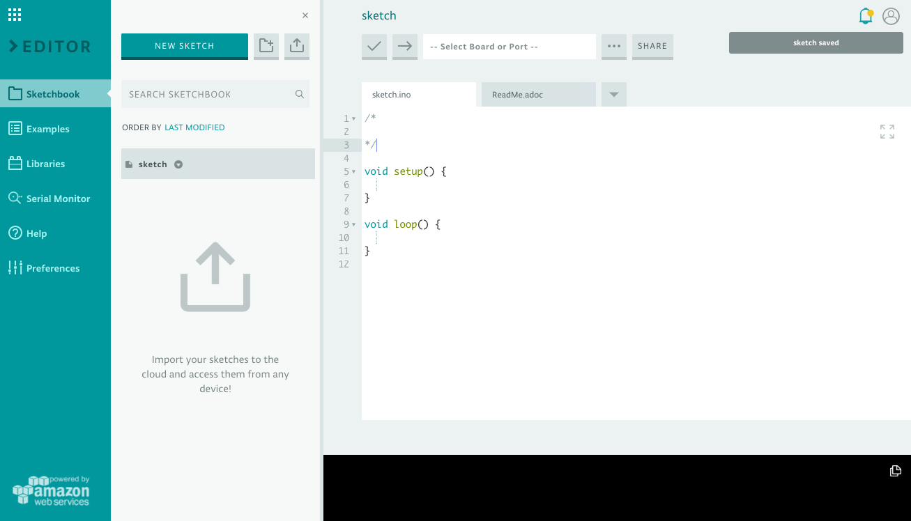

# マイコンをはじめよう
- 書いた人: Kenichi Ito(nichiden_27)
- 更新日時: 2017/03/15
- 実行に必要な知識・技能: 特になし
- 難易度: 2/少しやれば可能
- 情報の必須度: 2/知ってると楽

## 概要
マイコンとは、小型のコンピュータシステムのことです。
和製英語なので注意。"microcomputer"だとパソコンも含んでしまうので、"microcontroller"と呼べば間違いはないかと。

最近では`Arduino`や`mbed`に代表される手軽なマイコンボードが増え、かなりの用途に対応できます。これらについても簡単に解説します。

## マイコン比較
いろんな会社がいろんなシリーズを出している。
よく見るのだとPIC/AVR/H8/ARMなど。

- PIC
    + Microchip Technology Inc.が展開
    + 日本で人気があり、情報も充実している
    + その昔アセンブラの開発環境のみ無料だった時代があり、先人たちが苦労していた
    + 今ではC原語で書ける[MPLAB X](http://www.microchip.com/ja/mplab/mplab-x-ide)というIDE(統合開発環境)が無償配布
    + [秋月電子で山ほど売っている](http://akizukidenshi.com/catalog/c/cpicr/)ので入手性はおそらく日本一
    + ライタ(書込み機)は[PICkit3](http://akizukidenshi.com/catalog/g/gM-03608/)や[AKI-PIC](http://akizukidenshi.com/catalog/g/gK-02018)など
- AVR
    + Atmel Corporationのマイコン
        * だったが、2016年にMicrochipに買収された
    + Arduinoで゙使われている
    + 主にTinyシリーズ(下位)とMegaシリーズ(上位)に分かれる
    + [Atmel Studio](http://www.atmel.com/ja/jp/microsite/atmel-studio/default.aspx)というIDEを無償配布している
    + ライタはAVRISP mkIIなど(秋月のサイトから消えてる...)
        * 自作もできるらしい
- H8
    + 日立製作所→Renesas Electronics
    + よく知らないけど高性能らしい
- ARM
    + ARM Holdingsによるマイコン
    + 消費電力が少なくスマートフォンでの採用が多い
    + mbedにも使われている

プラネ用途であればPICかAVRで十分であろう。

以前は"C言語を使うならAVR"ということで、23-25の代でAVRが多数使われた。
しかしPICもC言語で開発できるようになり、27ではPICを使用していた。
今では、どちらを採用しても支障はないだろう。

## マイコンボード比較
マイコンの多くは、ICチップと見た目が似ている。
ピンに自力で配線をつながなければプログラムを書き込むことすらできない。
これでは、初心者に優しくないのはもちろん、経験のある開発者にとっても手間が多くなってしまう。

最近人気となっているArduinoやmbedは、マイコンを載せた基板に電源や通信用のコネクタをあらかじめ実装しており、思い通りの機能を手軽に試すことが可能だ。
両者は厳密には言語や開発環境などを含めたシステム全体を指すため、マイコンそのものとは違う。
ただ、本記事では簡単のため**「マイコンボード」** と呼ぶことにする。

なお、Raspberry PiやIntel Edisonなども見た目が似ているが、これらはOSを動作させることが可能で、よりコンピュータに近い使い方ができる。
本記事ではマイコンとは区別し、詳しくは取り扱わない。

### Arduino
AVRマイコンを使ったマイコンボード。
イタリア発祥のため読み方に悩むが「あるでぃーの」みたいな感じらしい。

世界中で普及しており、日本においても解説記事、ブログ共にたいへん充実している。
シールドと呼ばれる拡張基板が充実しており、通信やインタフェースなどの機能を追加できる。

2015〜2016年にかけて運営会社が内部分裂を起こしていた経緯があり、公式サイトも[arduino.cc](http://www.arduino.cc)と[arduino.org](http://www.arduino.org)の二種類存在する。
混乱は製品ラインナップやIDEにまで及び、微妙に違う二バージョンが混在するという面倒な事態になっていたが、現在は和解、統合している。

公式サイトもどちらを使っても問題ないはず。筆者はarduino.ccしか見たことがないが不便を感じたことはない。

#### 購入
[秋月電子](http://akizukidenshi.com/catalog/c/carduino1/)や[千石電商](http://www.sengoku.co.jp/mod/sgk_cart/search.php?cid=4186)、[マルツ](http://www.marutsu.co.jp/GoodsListNavi.jsp?narrow1Cond=Arduino)といった有名な電子部品屋にはだいたい売っている。
ネットのみだが[スイッチサイエンス](https://www.switch-science.com/catalog/list/40/)でも買えるようだ。

価格は3000〜5000円程度。
安くはないので、一台を様々な用途に使い回すことが多くなるだろう。

ただ、Arduinoの設計は公開されていて、誰でも自前で作って販売することが可能だ。
従って本家との互換機が多数売られており、中には価格面で本家を大幅に下回るものも存在する。

例えば、国内で買うと3000円弱かかるArduino Nanoの互換機が、中国サイトなどで300円ちょっとで入手できてしまう(送料はかかる)。
信頼性が要求される場合や、初めてArduinoを使うときは避けるべきだが、沢山のArduinoを必要とする場面などでは検討してはいかがだろうか(クレカ情報を守るためpaypal推奨)。

安い互換機は、USBシリアル変換チップに`CH340G`という中国製品を使っていることが多々ある。
最近のWindowsなら刺せば認識するようだが、Macで初めて使う際はドライバを入れねばならない。[江苏沁恒股份有限公司のページ](http://www.wch.cn/download/CH341SER_MAC_ZIP.html)から落としてきてインストールしよう。

#### 開発環境
開発にはArduino IDEをPCにダウンロードする必要がある。2017年現在のバージョンは1.8系で、arduino.cc/arduino.orgのどちらでも同じものが入手できる。このIDEでスケッチと呼ばれるプログラムの作成からビルド、ボードへの書き込みまでを行う。

...はずだったのだが、2016年夏に[Arduino Create](https://create.arduino.cc/)がリリースされ、mbedのようにブラウザからオンライン開発環境(`Arduino Web Editor`)を使えるようになった。
まだ普及している印象はないが、コミュニティ機能などが充実しているようだ。
使いこなせれば強い味方になるかもしれない。

Arduino IDEの操作手順についてはWeb上に解説が数多くあるので述べない。

#### 言語
Arduinoは、ソフトウェアを専門としない層でも気軽に始められるようにとのコンセプトを持つ。
そのためか言語も独自のArduino言語を使用する。

C/C++風なので、経験者なら特に勉強しなくとも違和感なく書けるだろう。
それでいてArduinoで使う頻度の高い機能にはアクセスしやすくなっているので、とにかく初心者に優しい。

[本家のリファレンス](https://www.arduino.cc/en/Reference/)をはじめ資料も充実しており、ググれば大抵の問題は解決できるはずだ。
C++なので自分でクラスを作るのも自由。

### mbed
ARM社とNXP社が提供するマイコンボード。
公式推奨の読み方は「**エンベッド**」。
ブラウザで[developer.mbed.org](https://developer.mbed.org/)にある開発環境を使うというのが最大の特徴。

自分のマシンにいちいち開発環境を入れるよりも、通信環境さえあればどこからでも使えた方が良いという発想である。
アカウントを共有すればチーム開発ができてしまうなど便利さがある一方、ネット接続前提というのが足かせになってしまうこともある(最近になりオフライン開発が容易になった、後述)。

日本国内にはコアなファンが結構おり、[mbed祭り](https://mbed.doorkeeper.jp/)というユーザイベントが度々開催されるなど盛り上がっている。developer.mbed.org自体がユーザコミュニティ機能を備えており、開発と情報収集・発信が連続しているというのが強みだろう。

#### 購入
秋月電子やスイッチサイエンスなどで扱っている。

mbedの中で一番有名なのは`LPC1768`だ。
コンパクトで高性能だが、価格は6千〜7千円と安くはない。
低電圧版の`LPC11U24`でも5千円ほどはする。

そのためホイホイと買えなかったmbedだが、**mbed-enabled** プラットフォームの登場により状況は変わった。
ハードウェアの設計がオープンソースとなったことで、mbedの開発環境で使用できるボードが数多く生まれたのだ。
その全容は公式の[platforms](https://developer.mbed.org/platforms/)で確認できる。

なかでも、秋月電子などで容易に購入できるものにSTmicroの"`Nucleo Board`"がある。
搭載するマイコンの種類やフラッシュメモリの容量によって数十種が存在し、そのうち20種弱は[秋月電子](http://akizukidenshi.com/catalog/c/cstm32/)や[スイッチサイエンス](https://www.switch-science.com/catalog/list/615/)などから入手可能だ。
さらに、大部分が1500〜1900円程度と、本家mbedに比べて安価に購入できる。

`Nucleo Board`にはArduino UNOとピン配置の互換性があるため、Arduinoのシールドを流用できる場合もある。Arduinoに慣れている人にも触りやすいボードかもしれない。

また、変わったケースとして[LPC1114FN28](http://akizukidenshi.com/catalog/g/gI-06071/)というのもある。
これは、見た目は28ピンのマイコンだが、mbed対応だ。
USBでPCと繋いで他のmbedと同じ感覚で扱えるボードもあり、一個400円(110円の時代もあったらしい...)のマイコンを載せ替えれば使い回せる。
流石にボード型のものと比べて性能に制限はあるが、予算を抑えたい場合や多数のmbedを揃える場合に選択肢になりうる。

#### 開発環境
さきに述べた通り、mbedの開発環境はオンラインに存在する。
mbedを買ってアカウントを作成すれば早速使えるようになり、どこからでも保存したコードを閲覧できる。
開発環境自体も自動ヘルプ機能やライブラリのリファレンスを備えており、コードを書いていて特段不自由は感じない。

ビルドが成功すると拡張子`.bin`のファイルがダウンロードされる。
これをフラッシュメモリとして認識されるmbedのルートディレクトリに配置するだけで書き込み完了だ。
リセットボタンを押せば書き込んだプログラムが動作する。

どうしても、オフラインでコンパイルをしたい場合がある。
従来は、オンラインIDEの機能でプロジェクトを書き出した上で、自前で構築したARM向けの開発環境でビルドしていた。

2016年8月、`mbed OS 5`がリリースされる。
これは、それまでのいわゆるmbedである`mbed 2.0`と、IoT向けのOSである`mbed OS 3`を統合した新たなmbedのソフトウェア基盤だ。
これに伴い、コマンドラインの開発環境`mbed CLI`が使用可能になった。

`mbed CLI`は、`mbed 2.0`のコードをインポートしてビルドすることもできる。
本家ツールだけあってmbedとの親和性や機能性は優れているようなので、オフライン環境が欲しくなった際は使ってみてはいかがだろうか。
詳細は、[mbed オフラインの開発環境](https://developer.mbed.org/users/MACRUM/notebook/mbed-offline-development/)を確認されたい。

#### 言語
C++をベースとしている。
C++を書き慣れている開発者は違和感なく扱える一方、プログラム自体初心者だと意味を理解するのにしばらくかかるかもしれない。

Arduinoより後発のため、`=`などの演算子をクラスごとにオーバーロードするなど直感的に書くための工夫が進んでいる。
また、オンラインIDE自体にコミュニティ機能・コードの公開機能があり、他ユーザが公開している既存資源を簡単に自分のプロジェクトに取り込める。
mbedのシステムをフル活用すれば、かなり快適に開発を進められそうだ。

## 結局何を選べばいいのか
ここまで長々と書いてきたが、一体どのマイコン(ボード)を買いに行けばいいのだろう。

Arduinoやmbedといったマイコンボードの使い勝手は年々進化し続けており、従来のマイコンからは考えられない開発スピードを実現できる。
学生団体レベルの製作物ならば、無理に素のマイコンを使おうとせず、マイコンボードを採用して構わないだろう。

Arduinoとmbedには、双方に様々種類がある。
習得もそれほど大変でないので、それぞれの特徴を知った上で目的に合わせて選ぶのが良いだろう。
特に出力ピン数は、ボードを選ぶ際足りているかよくよく確認すべきである。

高性能のコアが全く必要ない用途や、電流サージの危険があり高価なボードを故障の危険に晒したくない場面では、PICやAVRといったマイコンの技術が生きてくる。
ひとたび動かし方を習得すれば、安くて小回りのきくマイコンは強い味方になってくれることだろう。

そうしたマイコンが実際に使われている機材の修理や、ソフトウェア改修を任されることもある。
幸いにも書き込み機や予備のマイコンがあらかじめ用意されているなら、PICやAVRの開発環境は出費なしで揃えられる。
先達の残したコードを解読していけば、あなたのマイコンの知識も深まるかもしれない。
