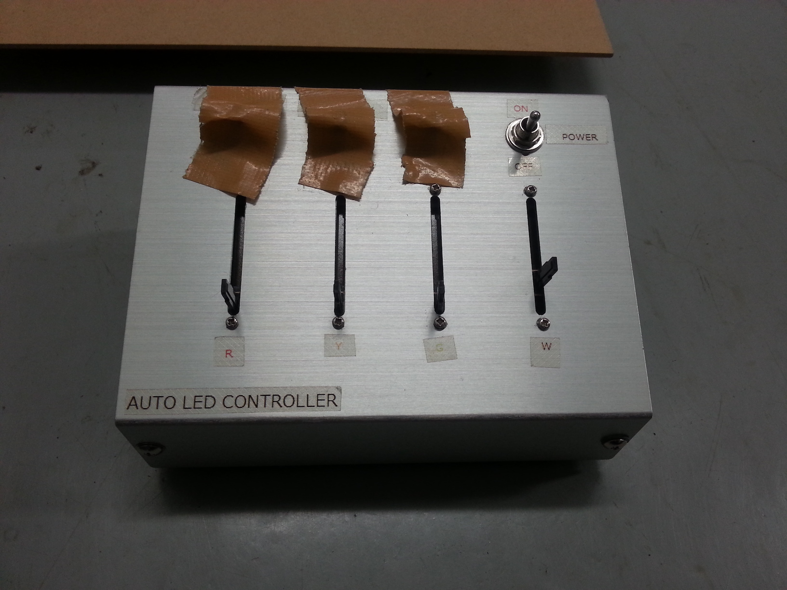
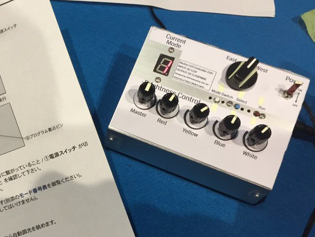
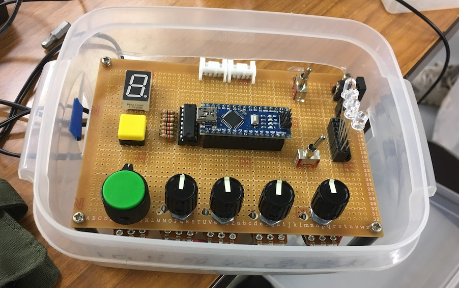
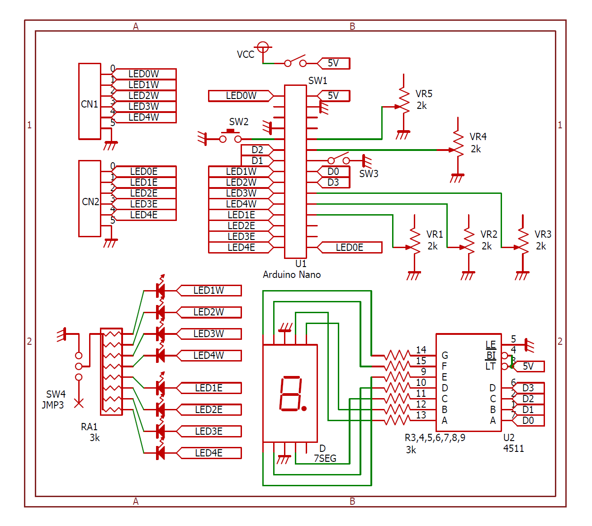

# 補助投影機との連携
- 書いた人: Kenichi Ito(nichiden_27)
- 更新: Kenta Suda(nichiden_28)
- 更新日時: 2018/09/26
- 実行に必要な知識・技能: 電子回路、マイコン、Arduino
- タスクの重さ: 2/数日かかる
- タスクの必須度: 3/年による

## 概要
補助投影機は主に1年生で構成されており、電気回路の知識が十分とは言えません(例外もある)。
そのため**補助投の電気関連の作業のサポート**も日電の仕事になっています。
主投影機関連ほどの労力はかからないので、随時進捗を見ながら助けになってあげましょう。

以下では、各投影機の**コントローラー**について書きます。
それ以外にも、投影機自体の回路や部品について聞かれることもありますが、臨機応変に対応してください。

## あおとう
現状、電球を毎年利用する唯一の投影機。
全投影機を**同時に調光**できる必要がある。

電球はAC100Vなので、交流のまま**調光回路だけを挟めばコントローラーになる**。
使用しているのは、ドームコンソールでも採用している秋月電子の[トライアック万能調光器キット](akizukidenshi.com/catalog/g/gK-00098/)。
このコントローラーをあおとうに使っている延長コードの根元に入れればよい。

電球の調光であればキットを一個そのまま使うだけでよく、故障も極めて起きにくいので、数年前のものを毎年使っている。
なお、同キットには秋月電子によるやたら詳しい説明書が付いているので、念のため一度は目を通しておきたい。

気をつけたい点としては、アルミケース上面に付いている**ボリュームの取り付けが緩む**ことくらいだ。
ツマミがぐらついていたら締めておこう。

*主な使用部品*

- [トライアック万能調光器キット](http://akizukidenshi.com/catalog/g/gK-00098/)
- アルミケース

## あくとう
あくとうは、多色のLEDの明るさを制御する。
本体の回路製作自体が複雑で工数もかかるので、**コントローラの仕事は日電に回ってくることが多い**。

あくとうの場合は特に、投影機のコンセプトとコントローラの機能が密接に関わってくる。
コンセプトの**聞き取りをしっかり行う**こと、投影機自体に関わる意思決定は**なるべくあくとうメンバーに委ねる**ことを心がけよう。

### あくとうコントローラの歴史
#### 砲弾型LEDの調光
LEDの明るさは電流や電圧などに対して線形には変わらないので、一般には**PWM(パルス幅変調)**という方式を使う(ここでは特に解説しない)。
LEDの電源自体を高速でオンオフする手法が用いられた。

16~17主投の代で、ロジックICなどを駆使して自前のPWM回路を作成していた記録が残っている。
22日電の時に作られたコントローラには、「**メモリ機能**」というものが実装されていた。
これは、**発光パターンを記録しボタン一つで再生**しようという意欲的なものであったが、翌年には使用できなくなってしまった。

24日電では、メモリ機能を取り除き基板とプログラムの改修を実施した。
この時期のあくとうは、通常のLEDを大きな平板に付けたものを並べるという方式(LEDの個数は144個にのぼったという)を採っていた。
そのため、コントローラの他に東西切り替え器(信号を東西に分ける)・分配器(信号を各板に分ける)などの周辺機器も存在した。

#### パワーLEDの調光
25主投(26補助投)の時、あくとうが**パワーLEDを採用した**。
パワーLEDは大電流を制御する必要があり運用が難しいが、秋月電子などが販売する「**定電流方式ハイパワーLEDドライバモジュール**」を使用すれば、12Vを供給するだけで点灯する。

このドライバモジュールには`CL6807`([データシートPDF](http://akizukidenshi.com/download/ds/chiplink/CL6807_p.pdf))という制御ICが搭載されているが、このICが調光機能を持っている。
`ADJ`というピンに以下のような入力を与えることで明るさを制御できるのだ。

1. 0.4V未満: 消灯
1. 0.5V ~ 2.5V: 電位による調光
1. 6Vまで: PWMによる調光

25日電は、**これまでのコントローラを流用**できる3番目の方法を使用した。
これまではコントローラから直接LEDに電力を供給していたが、26あくとうで別電源になったため、新たにプルアップ回路を追加して対応したという。

#### 自動化の試み
27あくとうでは、コントローラ自体を全面的に作り替えた。
投影機の目標が**操作の自動化**であったこと、東西切り替え器などの周辺回路をコントローラ自体にまとめようとしたことがその理由である。

自動モードか手動モードかを数字で区別できる**7セグメントLED**や、東西切り替えをコントローラ内で行う**ロータリスイッチ**が新たに追加された。
マイコンは製作者が慣れていたためPICを使用した。

製作の遅れや単純なミスによる不具合は多々あったが、設計自体の大きな問題点を以下に列挙する。

1. 自動モードは停止やスピード変更ができず、**他投影機とタイミングが合いにくい**
    * (必ずしもすべてを自動にするのが最良とは言えない例である)
1. ロータリスイッチがノンショートタイプ(回す際回路が一度切れる)であり、東西切り替え時に信号が途切れる(=**投影機が全点灯**)
    * 本番では、東西切り替え前に一度投影機の電源を落とす対応をした
1. 調光でパワーLEDを消灯させた後、**電源ケーブルを抜くと一瞬LEDが光る**
    * ドライバモジュールのコンデンサに溜まった電荷が解放されるためと推測される
1. アルミケースのメンテナンス性が悪い
    * 堅牢だが開けにくく、導電性があることによる誤動作も起きた
    * **タッパを使おう！**
1. PICを使用した
    * 不具合対応できる人員が実質一人しかいなかった
    * 無理に素のマイコンを使っても苦しむだけではなかろうか

### 現在のあくとうコントローラ
現在、最新のあくとうコントローラは27日電が2016年に製作し、28日電が変更を加えたものである。

問題の多い全自動モードを廃止し、専用の**つまみを回すことで時間を進める**半自動モードを実装した。
時間の進み方を担当者が調節することでタイミングを合わせやすく、しかも4色を別々に操作するよりはるかに手間が少ない。

27あくとうの反省から、制御にはマイコンボードの**Arduino Nano**を使用し、**ケースはタッパ**として修理・デバッグを容易にした。
また**PWM機能が生きているかその場で確認**できるデバッグ用LEDを装着できるスペースも追加した。

#### 回路

回路図を掲載する。

基本の構成はこれまで同様、ボリュームの抵抗値をマイコンが読み、出力端子からPWMを発生させるというものだ。

出力端子は10個使用し、**東西切り替えをソフトウェアで実現する**こととした。
使用する側の5本からはPWM信号が送られ、残り5本は電位が0Vに落ちる仕様だ。
回路図左上のCN1/CN2が投影機に接続するコネクタ、左下のLED群はデバッグ用LED(実際は取り外し可能)。

本体と違い、**電源電圧が5Vなので注意する**こと。
間違えて12VをつなげるとArduinoが壊れてしまうので**絶対にやってはいけない**。

#### プログラム
[AkutouController29.ino](https://github.com/Triangulum-M33/nichiden28/blob/master/akutou/AkutouController29/AkutouController29.ino)をArduino IDEで書き込んでいる。
なお、このコードは27日電の作成した[AkutouController28.ino](https://github.com/macv35/nichiden27/blob/master/akutou/AkutouController28/AkutouController28.ino)を加筆修正したものである。
全ては解説しないので、必要に応じコードを読んで理解していただきたい。
なお、言語はC++である。

Arduino NanoにはPWM用の端子が6本ある。
しかし、東西切り替えスイッチを物理的に作ると配線が面倒なので、**10本の端子からPWMが出せる**ようにした。

当然標準のライブラリでは対応できないので、マイコンの機能に頼らずにPWMを発生させねばならない。
幸い先人が作成したライブラリがいくつかあり、今回は[bhagman/SoftPWM](https://github.com/bhagman/SoftPWM)を使用した。
`SoftPWMSet(ピン番号, 0~255までの整数)`という関数で、デジタル出力ピンからPWM信号を出力できる。

28のあくとうは4色だったので出力ピンが8本であったが、29のあくとうで5色になったので、出力ピンが10本になった。
そのため、シリアル通信のTX用のピン(D1)をPWMの出力用に使うようにしたので、実行中に**パソコンとのシリアル通信ができなく**なっている。
28あくとうの時はシリアルプリントによるデバッグができるようになっていたが、D1を使ったことでそれができなくなった。
シリアルプリントをしようとすると挙動がおかしくなる可能性があるので、すべてコメントアウトしてある。

また、29のあくとうで色を5色に増やしたことでRAM不足のエラーが出た。
これを解決するために発光パターンの配列を**フラッシュメモリに保存**するようにした。
フラッシュメモリに関しては[「Arduino 日本語リファレンス」の該当ページ](http://www.musashinodenpa.com/arduino/ref/index.php?f=0&pos=1830)を参考にするとよいだろう。

コード中で`HC4511`というクラスを定義しているが、これは[74HC4511](http://akizukidenshi.com/catalog/g/gI-11905/)という7セグLEDドライバIC用に作ったものである。
`write(int value)`で数字を表示できるようにしてあり、さらに`=`演算子をオーバーロードして数字を代入するだけで使える仕様としている。

プログラム自体は、初期化→loop関数でPWM発生→ボタンが押されたら割り込みでモード変更 という流れになっている。
発光パターンを変えるだけであれば、`PROGMEM const unsigned char LightPattern[3][5][120]`という配列の中身を書き換えるだけで良い。
こうしたカンマ区切りの整数列は、**Excelのオートフィルで数字を自動入力**した後カンマを付け足してコピペすることで容易に生成できる。   

*主な使用部品*

- Arduino Nano
- [7セグメントドライバ HD74HC4511P](http://akizukidenshi.com/catalog/g/gI-11905/)
- [7セグメントLED(カソードコモン)](http://akizukidenshi.com/catalog/g/gI-00640/)
- 他スイッチ・ボリューム・コネクタなど

## しるとう
しるとうは消滅していた時代もあったが、23主投の代で復活し発展を続けている。
近年では街明かりの再現も兼ねており、消灯する場面をよりドラマティックにするため**調光機能**が必要とされる。

25代しるとうまでは電球を使用し、あおとうコントローラと同じ仕組みで調光できたが、26代からパワーLEDに切り替えた。
PWM信号をドライバモジュールに送ることで調光を試みたが、ドーム内ではうまく動かず、二年連続で断念している。
原因は確定していないが、あくとうより遥かに**ケーブルが長く(30m程度)PWM信号が減衰してしまう**ためと考えられている。

27日電の時に、パワーLEDモジュールの調光ICを**電位変化(0.5V~2.5V)で制御する方法**が確立され、本番で調光に成功した。
電位を変化させるだけならば、**抵抗二つと可変抵抗二つ**で作れてしまう。
原理はぎんとうの調光と全く同じであるのでそちらの回路図を参考にすること。
ただし、ぎんとうと違い、調光用には5Vの別電源を用いている。
**グラウンドの共通化**を忘れないようにしよう。

*主な使用部品(数値は電源が5Vの場合の例)*

- 抵抗(1.2kΩ／240Ω)
- 可変抵抗(1kΩ)

理論上この抵抗値でよいはずなのが、これだと完全に消灯しなかったため抵抗値を調整してある。
実物を見て確認すること。

また、電源の電圧がLEDは12Vであるが、**コントローラーの電圧は5V**であるので注意すること。

## りゅうとう
りゅうとうは毎回機構が大きく変化するため、コントローラの類も自分たちで製作することが多い(25日電がモータ制御用の回路を製作した事例はあるが)。
質問を受けたら答える程度で構わないだろう。

## あゆとう
あゆとうは1WのパワーLEDを1つ使っているのみである。
必要な部品や配線の仕方を聞かれたら答える程度で大丈夫だろう。