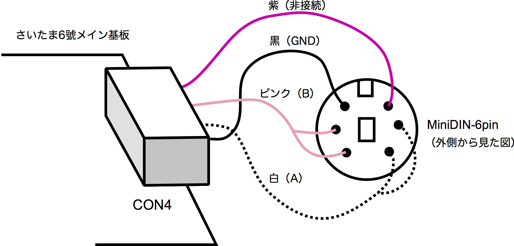
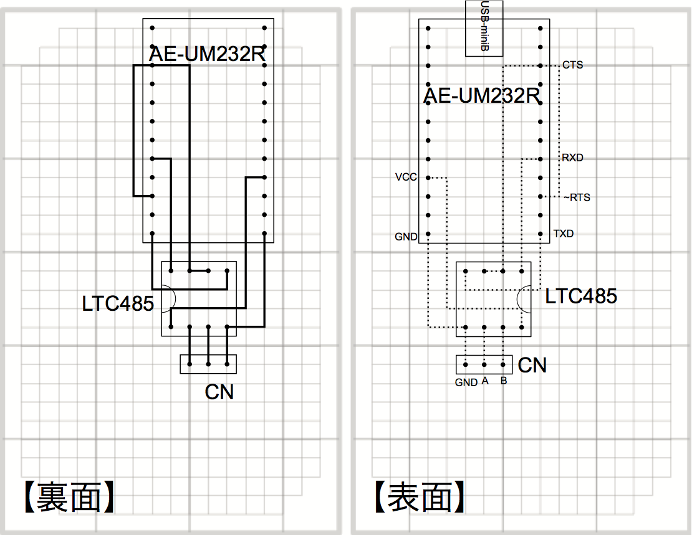

# 日周緯度変(Ikebukuro)
- 書いた人: Kenichi Ito(nichiden_27)
- 更新日時: 2017/02/26
- 実行に必要な知識・技能: 電子回路
- タスクの重さ: 2/数日かかる
- タスクの必須度: 3/年による
- 元資料
  + `日周・緯度変資料.pdf` by 岩滝宗一郎(nichiden_22)
  + `saitama.pdf` by 荒田 実樹(nichiden_23)

## 概要

さいたま6號には、外部機器(PCなど)を接続して制御することが可能です。これをさいたまの「**外部制御**」と呼んでいます。

埼玉6號の外部制御端子は`RS-485/Mini-DIN6`という規格・形状ですが、残念ながらこのままではPCに直接挿して外部制御することはできません。そこで、`RS-485/Mini-DIN6`と`USB`の変換を行うために製作されたのが、**変換モジュール`Ikebukuro`** (埼玉と繋がっているかららしい...)です。

実際に日周緯度変を動かす際に関わりの多い部分なので、使い方や構造などを解説します。

## 沿革
外部制御は、埼玉6號を製作した22代の時点で既に仕様に盛り込まれていた。ただし使用はされておらず、テストもされていない状態だった。続く23代で`Ikebukuro`が導入され、**PCを使用しての日周緯度変制御を初めて行った**。

その後の24〜27代では日周緯度変を操作するアプリの開発を行なっており、通信には`Ikebukuro`が使われ続けている。

## 使い方
さいたま6號側面に通信用の端子(`Mini-DIN6`)があるので、ケーブルで`Ikebukuro`の同じ端子に接続する。次に、`Ikebukuro`のUSB端子(miniB)とPCのUSB端子をUSBケーブルで接続すれば準備完了である。

さいたま6號の外部制御スイッチをONにすれば、PCからの信号を待ち受ける状態になる。あとは日周緯度変用のアプリなどを起動してシリアルポートに接続すれば良い。

## 電装
### 通信方式
埼玉6號の外部制御端子は、電気的には`RS-485`という規格に従っている。
`RS-485`では、3本の線(A,B,GND)で半二重通信(双方向の通信ができるが、同時に両方向の通信は不可)ができる。ノイズに強く、長距離にも耐えられるらしい。

埼玉6號の側部にあるMini-DIN6コネクタのピンとの対応は、図のようになっている。

### 内部基板
`Ikebukuro`の中身は単なる変換モジュールであり、`RS-485`と`UART`の変換を行うIC(`LTC485`)と、USBとUARTの変換を行うモジュール(`AE-UM232R`)が載っているだけである。

`AE-UM232R`に搭載されているUSB-UART変換チップ(FTDI社の`FT232R`という、定番チップ)の関係で、利用するにはPC側にドライバが必要な場合がある。[FTDI社のWebページ](http://www.ftdichip.com/Drivers/VCP.htm)から入手できるので、必要なら使用するPCにインストールしておこう。

また、このチップは初期状態から設定が書き換えられており、`InvertRTS=1`となっている。この設計はFTDI社謹製の`FT_PROG`(Windows用)というツールで設定できる。

`RS-485`は半二重なので、通信方向の切り替えが必要である。これは、シリアルポートのRTSピンを使用して行っている。

`Ikebukuro`の基板の配線を図に載せる。なお、図には反映していないが、RTSの状態確認用にLEDを実装している。

`AE-UM232R`はICソケットに差さっているので、容易に`Ikebukuro`から取り外すことができる。他の回路のテストでUSBシリアル変換モジュールを使いたい時は、`Ikebukuro`から`AE-UM232R`を取り外して使うと良いだろう(実際、23代で惑星投影機の基板のテストに利用した。最終的にはXBeeで通信するのだが、デバッグ時は「信頼と安定の」FT232Rを利用しようというわけだ)。

## プロトコルとコマンド
外部制御モードではPCからさいたま6號に指令(コマンド)を送る。ここでは、コマンドを表す文字列のフォーマットを述べる。

このフォーマットを変更したいと思ったら、さいたま側のプログラムの`main.c`とPC側のプログラムをいじればよい。

### 各コマンドに共通するフォーマット

| 位置 	| 0   	| 1   	| 2      	| 3     	| 4     	| ... 	|
|------	|-----	|-----	|--------	|-------	|-------	|-----	|
| 内容 	| `$` 	| `W` 	| *addr* 	| *len* 	| *cmd* 	| ... 	|
---

- *addr*: 機器のアドレス (16進1桁; ‘`0`’〜‘`9`’, ‘`A`’〜‘`F`’)
  - メイン基板上のディップスイッチで設定した値と一致させる
  - 現在は`0`が使われている
  - 複数の機器を繋いだ時用のアドレスだが、使うことはないだろう
- *len*: 以降のバイト数 (16進1桁; ‘`0`’〜‘`9`’, ‘`A`’〜‘`F`’)
- *cmd*: コマンドの種類

### 速度指定コマンド
| 位置 	| ... 	| 3   	| 4   	| 5       	| 6     	| 7..10   	| ... 	|
|------	|-----	|-----	|-----	|---------	|-------	|---------	|-----	|
| 内容 	| ... 	| `7` 	| `V` 	| *motor* 	| *dir* 	| *speed* 	| ... 	|
---

- *len*: 以降のバイト数 = '`7`' (7 byte)
- *cmd*: コマンドの種類 = '`V`'
- *motor*: モーター (日周:‘`D`’, 緯度:‘`L`’)
- *dir*: 回転方向 (時計回り:‘`+`’, 反時計回り‘`-`’)
- *speed*: 回転速度[deg/s] (16進4桁; ‘`0`’〜‘`9`’, ‘`A`’〜‘`F`’)

### 角度指定コマンド
| 位置 	| ... 	| 3   	| 4   	| 5       	| 6     	| 7...12  	| 13...16 	|
|------	|-----	|-----	|-----	|---------	|-------	|---------	|---------	|
| 内容 	| ... 	| `D` 	| `P` 	| *motor* 	| *dir* 	| *angle* 	| *speed* 	|
---

- *len*: 以降のバイト数 = '`D`' (13 byte)
- *cmd*: コマンドの種類 = '`P`'
- *motor*   モーター (日周:‘`D`’, 緯度:‘`L`’)
- *dir*     回転方向 (時計回り:‘`+`’, 反時計回り‘`-`’)
- *angle*   回転角度[`$10^{-2}$`deg] (16進6桁; ‘`0`’〜‘`9`’, ‘`A`〜‘`F`’)
- *speed*   回転速度[deg/s] (16進4桁; ‘`0`’〜‘`9`’, ‘`A`’〜‘`F`’)

### コマンド実例集
以上がさいたま外部制御コマンドの仕様だが、これだけでは少々分かりにくいはずなのでいくつか実例を挙げておく。

- 緯度モーターを3000deg/sで時計回りに回す -> `$W07VL+0BB8`
- 日周モーターを1800deg/sで時計回りに90000deg回す -> `$W0DPD+8954400708`

### PC側のプログラム
PC側からは、Ikebukuroが仮想COMポートに見えるので、そのCOMポートに対して上に述べたコマンドを書き込めば良い。この辺りの具体的な話は[外部制御アプリの資料](pc-software.html)に譲る。
