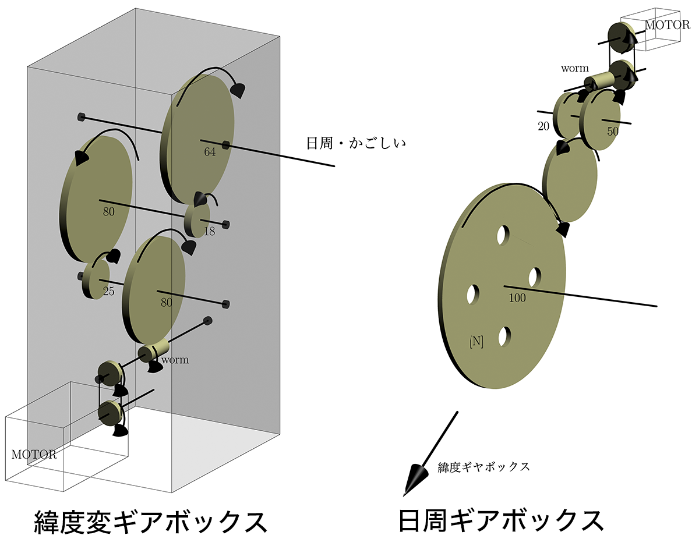

# 日周緯度変(日周緯度変換機構)
-   書いた人: Kenichi Ito(nichiden_27)
-   更新日時: 2017/03/03
-   実行に必要な知識・技能: 歯車機構
-   タスクの重さ: 5/準備だけで数ヶ月
-   タスクの必須度: 2/たまにやるべき
-   元資料
    -   `saitama.pdf` by 荒田 実樹(nichiden_23)

## 概要
日電の正式名称「日周緯度変・電源パート」から分かる通り、日電の本来の任務は日周緯度変装置を動作させることです。この記事では、日周緯度変装置自体に関しての情報をまとめます。

## 構成
日周緯度変の役割は、プラネタリウムにおいて日周運動を再現する、あるいは(仮想的な)観測地の緯度を変更することである。なお、天文部の現在のプラネタリウムには歳差軸はない。

日周緯度変は大きく

-   日周ギヤボックス
-   緯度変ギヤボックス

の2つに分かれ、それぞれに対応するステッピングモーターが搭載されている。

このステッピングモーターは一個数万円するものだが、本番中に劣化するので数年おきに買い換えられている。高価な割に**ケーブルが切れやすい**ので、取り扱う際は十分な注意を要する。

ギヤボックスはどちらも**10年以上前に製作された**ものである。製作年度に関して確かと言える情報は見つかっていないが、緯度は1994年の05主投、日周は2000年前後で製作されたようだ。

これほどの機構を再現できる技術が失われたため、かなりの長期間作り変えられていない。
ただし、いつかは必ず壊れてしまうものであり、**なるべく早期に予備を製作すべき**だろう。
日周緯度変の製作に成功すれば、天文部の歴史に名が残ることは間違いない。

特に緯度変に関しては、軸が摩耗していたり、ギアの噛み合わせが悪かったりして、
緯度を動かし続けるとある角度でかごしい全体が「揺れる」ことがある。この点は早急に改善が必要である。

ギヤボックス周辺の可動部分には**定期的にグリスを塗るか、潤滑油を差しておく**ことが望ましい。
ただし2017年現在、機構部分の保守作業の大部分は、**かごしいの作業の過程で行われている。**
ごきぶりやしいたけとの接続も彼らの方がより把握しているはずなので、任せておいて問題はないだろう。

## 歯車機構と減速比
日周緯度変を自在に操るには各ギヤ比を知っておく事が必要である。

もちろん実物を見れば調べられるのだが、それなりに面倒だったので同じ手間を繰り返さないよう図に各ギヤの歯の数を載せておく。
また、「正の向き(時計回り)」にモーターを回した時に各ギヤがどちら向きに回るかも載せておく。



図に書いてあるギヤの歯の数からギヤ比を計算すると、

```math
\begin{aligned}
\frac{1}{80}\times\frac{25}{80}\times\frac{18}{64}=\frac{9}{8192}
&&\text{緯度変} \\
\frac{1}{50}\times\frac{20}{100}=\frac{1}{250}
&&\text{日周}\end{aligned}
```

となる。なお、これらのギヤの歯の数は動かしながら手で数えたので、もしかすると数え間違いがあるかもしれない。あまり過信しないよう。

つまり、各軸をある角速度で回したい場合、緯度変の場合は`8192/9`を、日周の場合は`250`をそれぞれ掛ければモーターが出力すべき角速度が求まる。日周緯度変関連のソースコードで8192や250といった定数が登場するのは、この減速比の変換をするためである。

## モーターの角速度

ステッピングモーターは速度を自由に設定できるが、もちろん上限はある。緯度変更モジュール単体で試したところ、緯度モーターの最高角速度は$3500 deg/s$程度であった。

この速度をかごしいの速度に換算すると $3500/(8192/9)=3.84 deg/s$
となる。1度動かすのに0.26秒、南北の反転に46.8秒ほどという計算だ。

ただし、この$3500 deg/s$という速度は速度を徐々に上げていった場合の最高速度であり、停止した状態から回転させる場合は$1800 deg/s$程度が限度だと思われる。この場合かごしいの速度は$1800/(8192/9)=1.98 deg/s$となり、1度動かすのに0.5秒、南北反転には1分半かかることになる。

また、実際にかごしいを載せた場合や、主投影機を全て設置した場合など、回すものの重量によってさらに実際の速度は低下するので注意すること。
