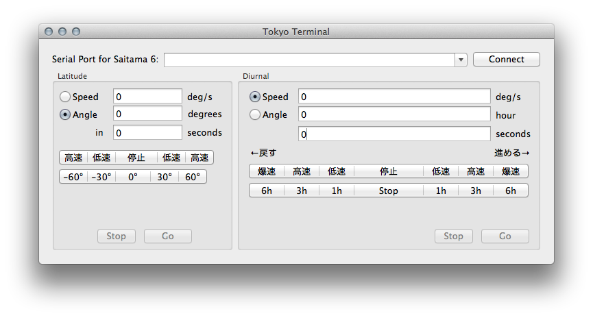
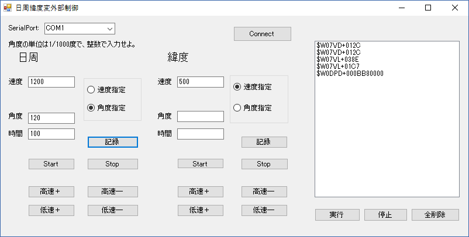
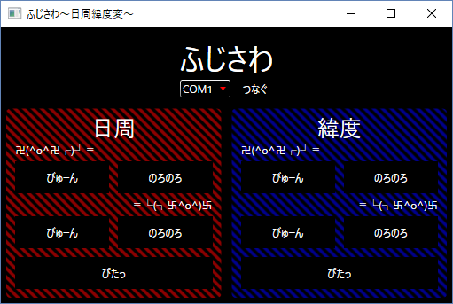
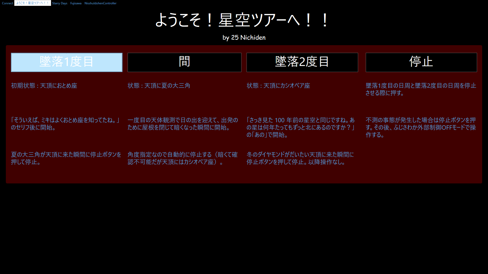
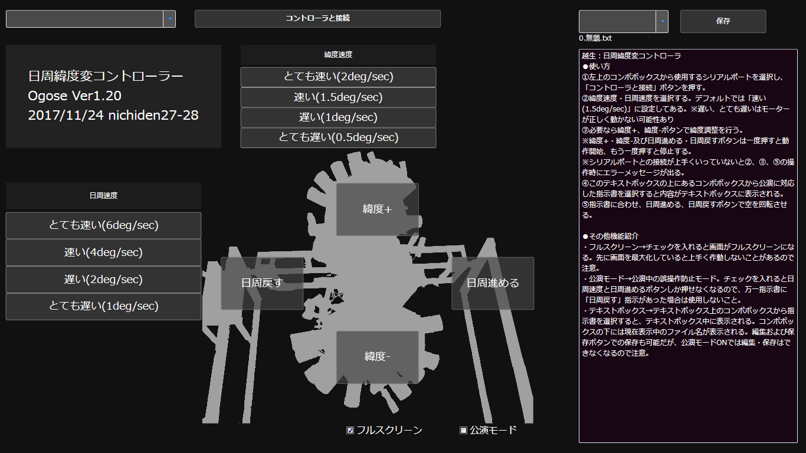

# 日周緯度変(外部制御アプリの歴史)
- 書いた人: Kenichi Ito(nichiden_27)
- 更新日時: 2017/03/04
- 実行に必要な知識・技能: 特になし
- 難易度: 2/少しやれば可能
- 情報の必須度: 2/知ってると楽
- 元資料
  + `引き継ぎと技術的補足：日周緯度変外部制御ユーザインタフェース.docx` by 紺野雄介(nichiden_23)
  + `ふじさわreadme.docx` by 池下 氏(nichiden_24)
  + `25の日周・緯度変について.docx` by 伊藤太陽(nichiden_25)

## 概要
[日周緯度変(外部制御アプリ)](pc-software.html)から歴代外部制御アプリケーションの紹介を分離した記事です。

現在は実装されていない機能があったりと、それぞれに特徴があるので、把握しておくと今後の改善に繋がるかもしれません。

## Tokyo Terminal(2012)

23代荒田氏が制作した。外部制御は23代で初使用されたが、`Tokyo Terminal`はそのテスト用に書かれたものである。

氏の環境がMac OSだったため、Macでしか動作しない。23代の作業データの`日周緯度変外部制御/Saitama6Brain/`以下にソースファイルやアプリ本体があるが、最新のMac OSでは対応していない旨が表示され起動しなかった。

これ以降の外部制御アプリは全てWindows向けに開発されたものだ。Mac向けに開発する必要に迫られることがもしあれば、`Tokyo Terminal`のコードが参考になるかもしれない(Mac開発の経験があれば一から書いた方が早い可能性も大いにあるが...)。

## NisshuidohenController2(2012)

23代紺野氏の作。`Tokyo Terminal`がMac専用だったため、Windows版として開発された。開発言語はC#で、Windows Formアプリケーション(`System.Windows.Forms`名前空間を使用)である。

`Tokyo Terminal`と共通の機能が多いが、大きな違いは**操作の記録・再生ができる** ことである。「速度指定」か「角度指定」かを選択して「記録」ボタンを押すと右のスペースに送るコマンドが表示され、同時に`Instruction.txt`というファイルにも保存される。

あらかじめ必要なコマンドを記録しておいて面倒な操作なしに再実行できる画期的な機能である...と言いたいところだが、**表示されるのはコマンドだけ**(数値は16進数)なので、肝心の再生部分が手軽に利用できるとは言い難い。

「高速」「低速」のボタンで出る角速度は以下の数値に固定されている。なお、上半分で入力する角速度はモーターのもの、以下の角速度はギアによる減速後のかごしいのものなので注意。
- 日周高速ボタン: 4 deg/s
- 日周低速ボタン: 1 deg/s
- 緯度高速ボタン: 1 deg/s
- 緯度低速ボタン: 0.5 deg/s

この数値は後発の`Fujisawa`、`Chichibu`でも同じものが使われている。

当時の日周緯度変は相応のスキルのある日電員が操作しており、自分たちで使うための最小限の機能を盛り込んだという印象だ。実際、本番中に使用したのは「高速」などのボタンだけだったという。

将来これを使うことはなさそうだが、速度・角度・方向に対応するコマンドを表示してくれるので、デバッグ用の計算機にはなるかもしれない。

## Fujisawa(2013)

24池下氏によるもの。引き続きC#によるWindowsアプリだが、UIのフレームワークに`Windows Presentation Foundation(WPF)`を使用している。

WPFの詳細についてはググって欲しいが、デザインとコードを分けて書くことができるというのが大きな利点である。つまり、内部の動作を崩さずに見た目だけをいじり倒せるのだ。その甲斐あってか、23のUIに比べデザイン面が大きく改善した。コマンド文字列を生成するコードは`fujisawa/NisshuidohenController.cs`でクラスにまとめて定義されている。

日周緯度変にPCを使うとき、一番問題になるのは画面が光ることだ。PCは画面も大きいし、そのために星がかき消されてしまいかねない。`Fujisawa`は、**黒基調の画面** にすることでPCの光害を抑制している。

使い方は見れば分かると思うが、「びゅーん」が高速回転、「のろのろ」が低速回転だ。また、本番で画面を暗くしているとマウス操作が大変なので、日周はキーボードでも操作できる。`C`: 高速逆転、`V`: 低速逆転、`B`: 停止、`N`: 低速順回転、`M`: 高速順回転 である。

総じて24日電の雰囲気がよく出ており大変分かりやすいものの、回転方向が少し把握しにくい。なお、アプリ名称は往時の天文部の「備品などに駅名をつける」習慣に則ったもので、「ふじさわ」は制作者の地元であるらしい。

## Chichibu(2014)

25伊藤氏が開発したアプリ。他にない特色として、25ソフト専用のモードが用意され、ボタンを押すだけでシナリオで要求された動きを実現できることがある。

また、23の`NisshuidohenController2`と24の`Fujisawa`の画面もそのまま移植され、それぞれの機能が利用できる。本番でも、ライブ解説時には`Fujisawa`を使っていたようだ。

フルスクリーン状態で起動することで、以前より更に画面の光漏れを抑えている。ただし、ソフト内に終了ボタンがないうえタイトルバーも見えないので、プログラムを終了させる際は`Alt`+`F4`を押すなどショートカットキーを使うしかない。

## Ogose(2016)

27日電の伊東が開発した。これまでのUIの問題点を洗い出した上で、改善すべく様々な変更を加えている。デザイン部分(`MainWindow.xaml`)は一から作り直したが、コマンド文字列生成は`NisshuidohenController.cs`を継続使用した。

指定できる速度が各軸4段階に増えたことで、多彩な演出が可能となった。また、速度指定のボタンを回転スタート/ストップボタンとは別に用意したため、回転を止めずとも速度を変更できる。

ウィンドウモードとフルスクリーンモードをボタンで切り替えられる機能も実装した。また、フルスクリーンボタンの横にある「公演モード」ボタンは、使用できる機能を「日周進める」に限定し誤操作を防止する機能である。キーボード操作などにより意図しない状態になるバグが存在するので注意。

思いがけないことに、ボタンを十字に配置したことで、ゲームコントローラーのボタンと同様の配置となった。本番ではゲームコントローラーを実際に使用し、慣れていない人でも操作ができるという恩恵があった。

実装についてなど、詳細は[外部制御アプリの記事](pc-software.html)に示すこととする。
