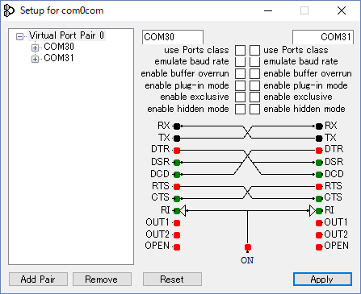
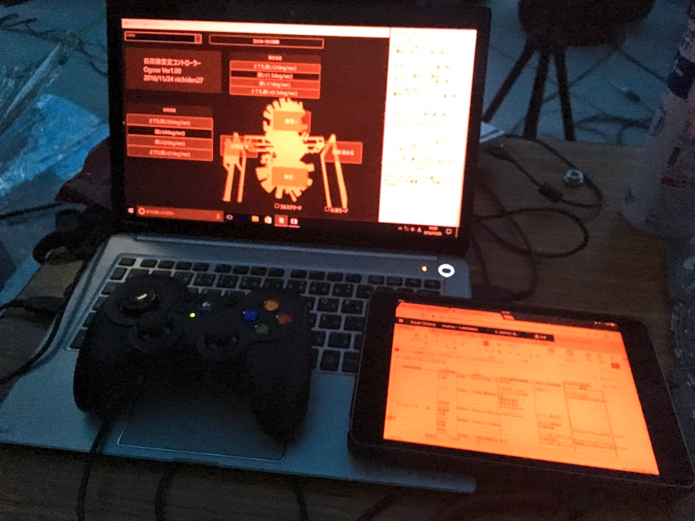

# 日周緯度変(外部制御アプリ)
- 書いた人: Kenichi Ito(nichiden_27)
- 更新日時: 2017/03/04
- 実行に必要な知識・技能: シリアル通信、C#
- タスクの重さ: 3/数週間
- タスクの必須度: 4/毎年やるべき

## 概要
日周緯度変の[外部制御](ikebukuro.html)には、大きな可能性があります。PCを使える以上かなり複雑な操作も自動化できるためです。

ただし、本番で日周緯度変を動かすのは人間である部員たち。
それも、プログラムの挙動を知っている日電員だけが操作するとは限りません(26・27と、かごしいにも日周緯度変操作を手伝って貰っています)。

誰にでも使いやすい日周緯度変外部制御アプリを作るために注意すべきことを書きます。

## 沿革
**過去に開発されたアプリケーションが多数にのぼるため、**[外部制御アプリの歴史](pc-software-history.html)**に分離する。**

## Ogoseの特徴と使い方
`Ogose`は、27代日電で作成した、2017/03/01現在最新の外部制御アプリである。

特徴は[沿革](pc-software-history.html)の方に文章で書いたので、ここでは簡単に箇条書きするにとどめる。


- 各軸4段階で速度を指定
- 回転中の速度変更が可能
- 回転の開始/停止はトグルボタン(押すたびにON/OFFが切り替わる)
- フルスクリーン切り替えボタン
- 誤操作防止用の「公演モード」
- キーボードでも操作可能
- フリーソフトを使ってゲームコントローラに操作を割り当て可能

### 基本操作
起動したら、まずは最上部からシリアルポートを選んで**接続ボタン**を押す。
さいたまを`Ikebukuro`を介して繋いだだけの状態ならポートは一つしか出ないことがほとんどだが、複数出たとしても一つずつ試してモーターが動くかどうかで判断すればよい。

未接続のままコマンドを送る操作をした場合は、エラーメッセージとともに送信するコマンドが表示される。
接続していないことに気づけるようにする一方、わざと未接続にすることでコマンド送信のデバッグも可能だ。

実際に日周緯度変を動かすときは、左側と上側にある**速度切り替えボタン**から速度を選び、動かしたい方向のボタンをクリックする。
起動後に一度も速度を選んでいないときは、各軸とも「速い」速度が選択される。

回転開始ボタンは押すと「停止」に表示が切り替わり、再度押すと回転が停止する。
反対方向のボタンは「停止」するまでグレーアウトしてクリックに反応しない。これは、ボタンの表示がおかしくなるのを防ぐためである。

**フルスクリーンボタン**にチェックするとフルスクリーンになる。
画面全体が黒背景になるので、本番中はフルスクリーンが望ましい。
**公演モード**ボタンは、ONにすると警告が表示され日周を進めることしかできなくなる。

モーターの回転はキーボード操作でもできる。

- `W`: 緯度+
- `A`: 日周戻す
- `S`: 緯度-
- `D`: 日周進める

と対応している。PCゲーマーには馴染みのある配置かと思う。

`Ogose`のコードの解説は、たいへん長いので別記事とする。

-> [Ogoseの実装解説](pc-software-code.html)

## 通信プログラム
### シリアル通信の基本
[Ikebukuroの記事](ikebukuro.html)にある通り、パソコン側からは`Ikebukuro`はシリアルポートとして見える。
よって、シリアルポートにアクセスするプログラムを書けばよい。

ポート名は、Windowsであれば`COM1`や`COM4`のように、「'`COM`'+数字」の形式である。
Mac OS XやLinuxのようなUNIX環境であれば、`/dev/tty.usbserial-A5017ABT`である。

シリアルポートの設定は、さいたま6號側のプログラム中に記述してある設定と一致させなければならない。
現時点での設定は、

- baud rate: 2400
- parity: none
- char bits: 8
- stopbit: 1

である。baud rateはこの値である必然性はないので、変えても良い(さいたま6號のプログラムも一緒に変更すること！)。

通信経路の途中で`RS485`を使っている関係上、シリアルポートには読み取りと書き込みのいずれか一方しかできない。

`RS485`の通信方向の切り替えには、シリアルポートのRTS端子を使う。
RTSが`HIGH`になるとパソコン側から日周緯度変側への通信ができ、`LOW`になると逆方向の通信ができる。
コマンドを送信する直前にRTSを`HIGH`にし、終了したら`LOW`に戻すといいだろう。

### .Netでのシリアル通信
`.Net Framework`を使う場合は、`System.IO.Ports`名前空間以下にある`SerialPort`クラスを利用すると便利である。
Mac OS XやLinuxでは`.Net`のオープンソース実装である`Mono`を利用できるが、`Mono`においても同様である。

以下ではC#のコード例を示す。

まず、ソースコードの冒頭に以下の文を書いておくと便利であろう:

```c#
using System.IO.Ports;
```

通信を開始する前に、まずポートを開く：

```c#
SerialPort port = new SerialPort(
  portName:portName,
  baudRate:2400,
  parity:Parity.None,
  dataBits:8,
  stopBits:StopBits.One
);
port.Open();
```

この後、`port.IsOpen`により、ポートを開くのに成功したか確認しておこう。

実際に通信するには`SerialPort.Write`メソッドを使う。プログラムを終了する際には、`port.Close()`によりポートを閉じておく。


### 他の言語でのシリアル通信
日電では23からC#で外部制御アプリを開発してきたが、他の各種の言語でもシリアル通信を扱えるので記しておく。

- C, Lua: [librs232](https://github.com/ynezz/librs232/)
- Lua: LuaSys
- Python: [pySerial](http://pyserial.sourceforge.net/)
- Ruby: [ruby-serialport](http://ruby-serialport.rubyforge.org/)
- Java: Java Communications API / RXTX(Windows)
- JavaScript(Node.js): [serialport](https://www.npmjs.com/package/serialport)

それぞれの使い方やインストール方法についてはググって欲しい。

### 仮想シリアルポート
開発中、きちんとコマンド文字列が送れているか確認したくなることがあるだろう。
**仮想シリアルポート**は、シリアルポートとして振る舞い、自分自身にデータを送信するループバックテストを可能にするソフトウェアだ。

Windows用だが、[com0com](https://sourceforge.net/projects/com0com/)を紹介する。



セットアップすると、互いに繋がった二つのCOMポートを用意してくれる。
番号は、他と被らないよう大きめにしておけば大丈夫だろう。

あとは、一方に作ったアプリから接続し、他方に`Tera Term`などのターミナルソフトで接続すれば、送っている内容が見えるようになる。

## 今後の展望

### GUIフレームワーク
日周緯度変をある程度誰でも動かせるようにするには、GUIは欠かせない。
歴代日電では、GUI開発にWindows FormアプリケーションやWPFを用いてきた。
もちろん他にもGUIのフレームワークは山ほどあるが、時間も限られている以上、定番で枯れた技術を使っておくのが無難ではなかろうか。

一つの可能性としては、最近イケイケのWebアプリがある。
ChromeとJavaScriptをベースにデスクトップアプリを実現する`Electron`など、ここ最近急速にシェアを伸ばしている技術もある。
もしあなたがそういった技術を得意としているなら、乗り換える価値はあるかもしれない。

### 入力機器
本番でアプリの操作性にはまだまだ改善の余地がある。
暗い画面ですばやく操作をするには、マウスよりもキーボードがいいし、タッチパネルやゲームコントローラーといった馴染みのある操作系も役に立つだろう。

ゲームコントローラーは、27プラネではフリーソフトでキー操作と無理やり関連付けしたが、`DirectInput`を使えば単体でも利用できる。
入力機器として完成されているし、操作に慣れている人も多いので、案外自前のボタン配置に凝るよりコスパがいいかもしれない。



### 機能追加
27の本番中、気になったことがある。
折角フルスクリーンモードで画面が光らないようにしたのに、画面右端に指示を書いた「メモ帳」が並べられていたのだ。
黒背景で指示やタイミングをメモしておけるよう、アプリの**画面内にメモ欄**を設けても良いかもしれない。

また、別の方向性として、**操作の記録・再生**が考えられる。
23や25で行ってきたことを発展させ、ボタン一つで一本のソフトをまるまる上映できるようになれば楽だろう。

ただし、当然ソフトの指示は毎年変わるので、開発の負担は増加する。
ライブ解説ではタイミングを人力で判断せねばならず、想定外の事態も起こりうる以上、全自動化への道は平坦ではない。
コストに見合うメリットが得られるような仕組みを、ぜひ考案してほしい。
