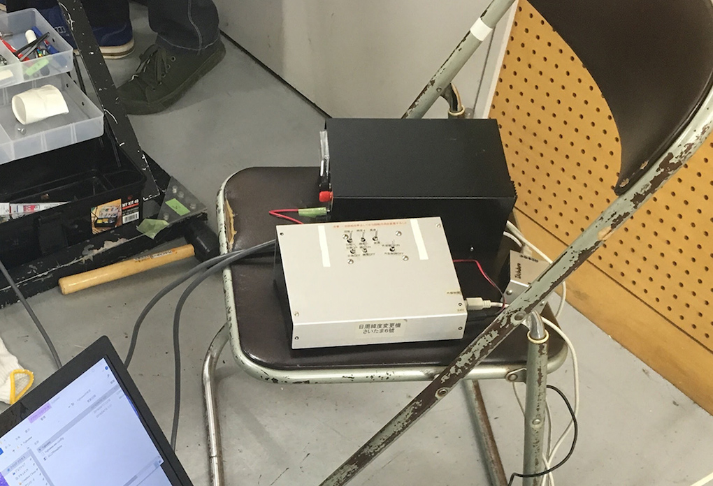
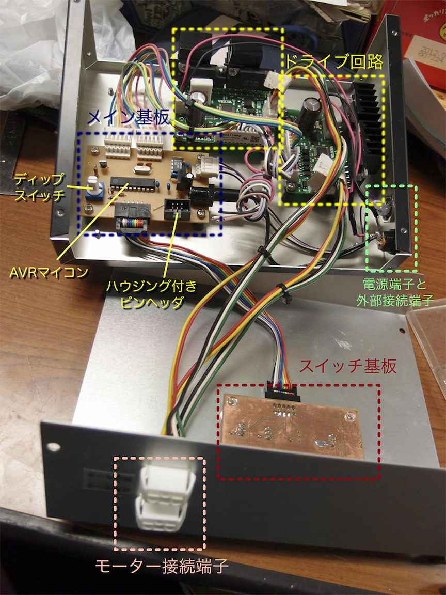
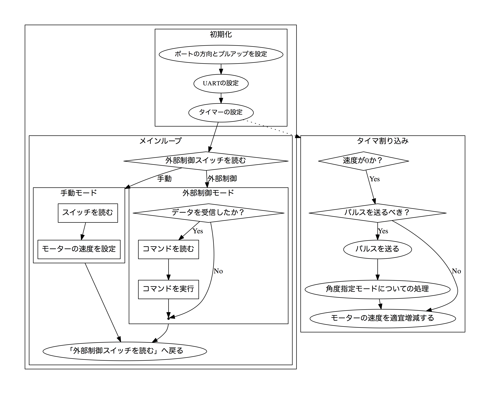
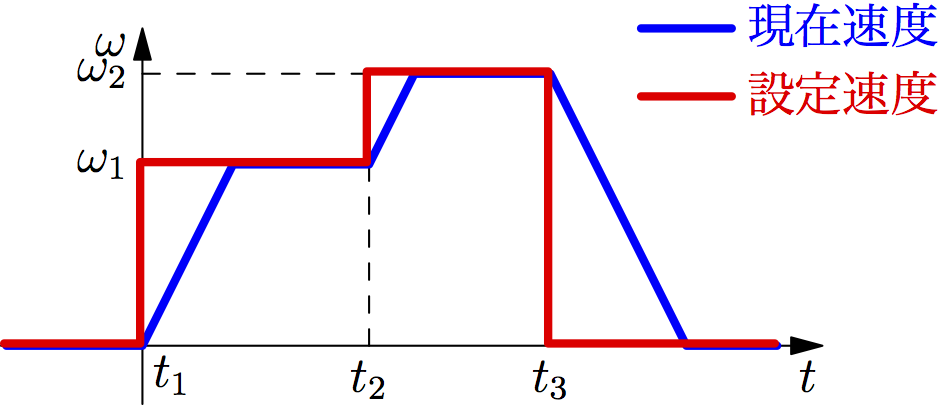

# 日周緯度変(さいたま)
-   書いた人: Kenichi Ito(nichiden\_27)
-   更新日時: 2017/02/26
-   実行に必要な知識・技能: AVRマイコン、電子回路
-   タスクの重さ: 3/数週間
-   タスクの必須度: 3/年による
-   元資料
    -   `日周・緯度変資料.pdf` by 岩滝宗一郎(nichiden\_22)
    -   `saitama.pdf` by 荒田 実樹(nichiden\_23)

## 概要
<pre style="font-family:IPAMonaPGothic,'ＭＳ Ｐゴシック',sans-serif;">
　　　　　　　　　　　　　　　　＼　│　／<br>
　　　　　　　　　　　　　　　　　／￣＼　　 ／￣￣￣￣￣￣￣￣￣<br>
　　　　　　　　　　　　　　　─（ ﾟ ∀ ﾟ ）＜　さいたまさいたま！<br>
　　　　　　　　　　　　　　　　　＼＿／　　 ＼＿＿＿＿＿＿＿＿＿<br>
　　　　　　　　　　　　　　　　／　│　＼<br>
　　　　　　　　　　　　　　　　　　　 ∩ ∧　∧　　／￣￣￣￣￣￣￣￣￣￣<br>
￣￣￣￣￣￣￣￣＼∩ ∧　∧　＼（ ﾟ∀ﾟ）＜　さいたまさいたまさいたま！<br>
さいたま～～～！ 　 ＞（ ﾟ∀ﾟ ）/ ｜　　　　/　＼＿＿＿＿＿＿＿＿＿＿<br>
＿＿＿＿＿＿＿＿／ ｜　　　 〈　｜　　　｜<br>
　　　　　　　　　　　　　 /　／＼_」　/　／＼」<br>
 　　　　　　　　　　　　　 ￣　　　　 / ／<br>
 </pre>

日周緯度変コントローラ「さいたま」の使い方や仕組みなどを説明します。壊れて部品交換が必要になった・新しいさいたまを作りたい際に参照してください。

## 沿革
日周緯度変のステッピングモーターを回すには、モータドライバという回路が必要になる。駒場祭プラネではモータドライバと制御基板を内蔵した専用コントローラーを使っており、2002年の[13日周以降](http://twitter.com/fujita_d_h/status/254087988882046976)今日に至るまで**「さいたま」**
と呼ばれている。

「さいたま」や他の回路に使用するマイコンは長らくPICであったが、22日電で**AVR**
が採用され、23日電、24日電でもこれを踏襲した。PIC時代はほとんどのプログラムがアセンブラで書かれていたが、AVRを使うようになってからはC言語が使われるようになった。

さいたまはたびたび作り変えられてきたが、現在使用しているのは22が製作した**さいたま6號**
である。23は、さいたまをPCから制御するための装置「Ikebukuro」を導入した(Ikebukuroの資料参照)。24では基板を作り直し、その際マイコンを**ATmega**
に変更したようだ。

## 使い方


背面に日周・緯度用に二つのコネクタがあるので、専用ケーブル※を使ってそれぞれのモータに繋ぐ。次に、モータの電力を確保するため、電源装置から**24V**
を右面のDCジャックから供給しよう。

※コネクタはELコネクタ(日本圧着)6極、ケーブルはVCTF0.5sq 5芯


コントローラ前面には6つのスイッチがある。現在では[外部制御](ikebukuro.md)でPCから動かす方がはるかに便利だが、PCが使えない緊急時や急いでいるときはこのスイッチを使えばよい。

ラベルを参照すれば大体の意味は分かることだろう。回転のON/OFFと方向はそれぞれの軸で独立しているが、回転速度は2軸で変えることはできない。`外部制御ON/OFF`スイッチは、PCから操作したい場合にONにする。これがONになっているときは、さいたま側のスイッチに反応しなくなるので気をつけよう。

## 電装
ケースの両側に付いているねじを全て外すと、さいたまの中身を確認できる。



-   メイン基板
    -   **画像は23引き継ぎのものだが、この翌年に作り変えられているので注意**
    -   マイコンがスイッチの状態を読取り、モータードライバにCW・CCWパルスを送信する
    -   基板に付いていたスイッチはあまり重要でなかったため、基板作り変えの際取り除かれた模様
    -   2×3のピンヘッダは、AVRマイコンにプログラムを書き込むためのもの
-   モータードライバ基板
    -   CW・CCWパルスに応じてステッピングモータに電流を流す
    -   既製品。割と高価だが、部室に未使用の買い置きがある
-   スイッチ基板
    -   トグルスイッチが配置されている
    -   普通に使っている場合一番壊れやすい部分なのでたまに異常がないか見てあげよう

## プログラム
23代が`nissyuido`ディレクトリ以下に使用したソースコードを残している。`WinAVR`環境があれば`default`ディレクトリに移動して`make`コマンドを打てばビルドされるとのことだ。

ただし、前述の通り**24代でマイコンをATmega328Pに変更** しており、以前のコードを使用できるかは定かでない。作り変えをする際は、24代の方に問い合わせてみることも検討されたい。

以下のプログラム解説は、23荒田氏の作成されたドキュメントと同内容である。必要なら氏のPDFや、コード中のコメントなども併せて確認すると良いだろう。

### main.c


プログラムの起点となる `main` 関数が入っている。
プログラムの大まかな流れは図を参照。

プログラムは初期化(`main.c`の`init`関数)の後、メインループ(無限ループ)に入る。ただ、初期化の時にタイマ割り込みを設定しているため、100マイクロ秒ごとに現在メインループで実行されている内容に関係なく「タイマ割り込み」の内容が実行される。

メインループの処理内容は`main.c`を、「タイマ割り込み」の処理内容は`motordrive.c`を参照されたい。

外部制御コマンドのフォーマットはここで処理している。

### motordrive.c
ここが最も重要な部分である。
ステッピングモーターのドライブ回路に定期的にパルスを送り、指定した速度でモーターを回す。

モーターを角速度$Speed$(コード中ではm->current_speed $[deg/s]$)で回すにはどうすればよいか考えてみよう。
一回のパルスでモーターが回転する角度はモーターとドライブ回路によって決まっており、$\mathrm{MotorStep}=0.72 \mathrm{deg}$(コード中ではMOTOR_STEP $[10^{-2}deg]$)である。

AVRのタイマ機能により、`motordrive`関数は$\mathrm{ControlPeriod}=100 \mu\mathrm{s}$(コード中ではCONTROL_PERIOD $[\mu\mathrm{s}]$)間隔で呼ばれる。
前回パルスを送ってからの経過時間を$n\cdot\mathrm{ControlPeriod}$とする(前回パルスを送ってから$n$回目の`motordrive`の呼び出し; $n$はコード中ではm->count)。

このとき、簡単な考察により、$n\cdot\mathrm{ControlPeriod}\cdot\mathrm{Speed}\ge\mathrm{MotorStep}$の時に次のパルスを送ればよいことが分かる。

実際には、速度指定モード・角度指定モードがあったり、速度を徐々に変化させる処理を行っているので、もう少し複雑なプログラムになっている。

「速度を徐々に変化させる処理」であるが、今のところ、現在の速度と目標速度が一致しなければ一定の加速度を加えるという、比較的単純な制御になっている。
時間と速度をグラフで表すと図のようになる。赤線が指定した速度、青線が実際の速度である。
このように速度を徐々に変化させるようにプログラムの改修を行ったので、もはや**「一旦回転を停止してから回転方向を変更する」必要はない。**



角度指定モードの、速度を下げ始めるタイミングについて。

プログラムが実行されている時点を時刻$t_0$とし、時刻$t_1$にモーターが停止するとする。
モーターの$t_0$における角速度を$\omega_0$とする。単位時間当たりのモーターの角速度の変化を$\alpha$とする。
現在のプログラムでは、`motordrive`が呼ばれるたびに速度を$1\mathrm{deg/s}$ずつ増減するので、
```math
\alpha=\pm\frac{1 \mathrm{deg/s}}{\mathrm{ControlPeriod}}
```
である。モーターの時刻$t$における角度(位置)を$\theta(t)$とする。

時刻$t$におけるモーターの角速度と角度はそれぞれ
```math
\begin{aligned}
    \omega(t)&=\omega_0+\alpha(t-t_0) \\
    \theta(t)&=\theta(t_0)+\omega_0(t-t_0)+\frac{1}{2}\alpha(t-t_0)^2
\end{aligned}
```
となる。 時刻$t_1$にモーターが停止、すなわち$\omega(t_1)=0$より、
```math
t_1-t_0=-\frac{\omega_0}{\alpha}
```
である。これを$\theta(t_1)$に代入すると、
```math
\begin{aligned}
    \theta(t_1)&=\theta(t_0)-\frac{\omega_0^2}{\alpha}
    +\frac{1}{2}\alpha\left(-\frac{\omega_0}{\alpha}\right)^2 \\
    %&=\theta(t_0)+\left(-\frac{1}{\alpha}+\frac{1}{2\alpha}\right)\omega_0^2 \\
    &=\theta(t_0)-\frac{1}{2\alpha}\omega_0^2
\end{aligned}
```
を得る。

求めたい量は、現在角がどういう値になったら速度を下げ始めるか、その角度である。
つまり、$\theta(t_1)-\theta(t_0)$の値である:
```math
\begin{aligned}
    \theta(t_1)-\theta(t_0)&=-\frac{1}{2\alpha}\omega_0^2 \\
    &=\frac{1}{2\left(\frac{1 \mathrm{deg/s}}{\mathrm{ControlPeriod}}\right)}\omega_0^2 \\
    &=\frac{\mathrm{ControlPeriod}}{2(1 \mathrm{deg/s})}\omega_0^2
\end{aligned}
```
ステップ数に換算するために両辺を$\mathrm{MotorStep}$で割ると、
```math
\frac{\theta(t_1)-\theta(t_0)}{\mathrm{MotorStep}}
=\frac{\mathrm{ControlPeriod}}{2(1 \mathrm{deg/s})\mathrm{MotorStep}}\omega_0^2
```
を得る。

なお、コード中では$\frac{\mathrm{MotorStep}}{\mathrm{ControlPeriod}}$に`MOTOR_MAX_SPEED`という名前を与えている。

### uart.c
外部とシリアル通信するための関数が記述されている。通信データのバッファリングを行っているが、この仕組みが正常に動いているかは検討の余地がある。

### timer.c
`motordrive`関数を$100\mu s$間隔で呼び出すための設定を行う。
ぶっちゃけ、`motordrive`関数をそのままタイマ割り込みハンドラにし
ても良い気がする。

### コンパイルするには
ソースコードを編集したら、書き込む前にコンパイルする必要がある。`default`ディレクトリ以下に`Makefile`が入っているので、`Makefile`の意味が分かる人は利用すると良いだろう。

Makefileの意味が分からない人は、Atmel Studioだか何だか知らないが、適当にプロジェクトを作ってファイルを放り込んでコンパイルすればよろしい。その際、

-   マイコンの種類は ATmega328P
-   クロック周波数は 16MHz:
    プリプロセッサの設定をいじって、`F_CPU=16000000UL`がpredefinedになるようにする。(コンパイラオプションとして`-DF_CPU=16000000UL`が渡されればOK)
-   言語規格はC99+GNU拡張(コンパイラオプションとして`-std=gnu99`が渡されればOK)

となるように注意する。

## 今後の展望
もしもさいたまを作り替えるようなら、もう少し強力なマイコンを搭載すること、センサー(後述)対応にすること、**通信経路** についてもっとしっかり考えること(`RS-485`にするのか、全部`RS-232`とUSBシリアル通信で統一するのか)が望ましい。

23代で相対角度指定が実装されたが(現在使われていない)、**絶対角度指定** があると良いだろう。つまり、投影される星空を見ながら日周緯度変を操作するのではなく、「緯度は何度、日周は何月何日何時」という形で指定できるようにする。

絶対角度指定のためには、角度センサーを設置して現在位置を取得するか、一ヶ所にフォトインタラプタなどを設置して初期位置を判別できるようにして、後はステッピングモーターのステップ数で現在位置を把握する、などの方法が考えられる。

いずれにせよ、さいたまを作り直す際に日周緯度変に設置したセンサーを接続することを考慮しておくとよいだろう。

PC側のソフトウエアだが、PCで操作する以上何らかのメリットが欲しい。
速度を柔軟に調節できるようにはなったが、操作性にはまだまだ改善の余地がある。
リアルタイムで操作するには、マウスよりもキーボード、欲を言えばタッチパネルでの操作の方がいい。いろいろ工夫してみると良いだろう。

もう一つの方向性として、操作の記録・再生が考えられる。
ボタン一つで一本のソフトをまるまる上映できると楽だろう。ただし、ソフトウエアを実装する手間、操作を記録しておく手間に見合うメリットがあるかよく考える必要がある。
