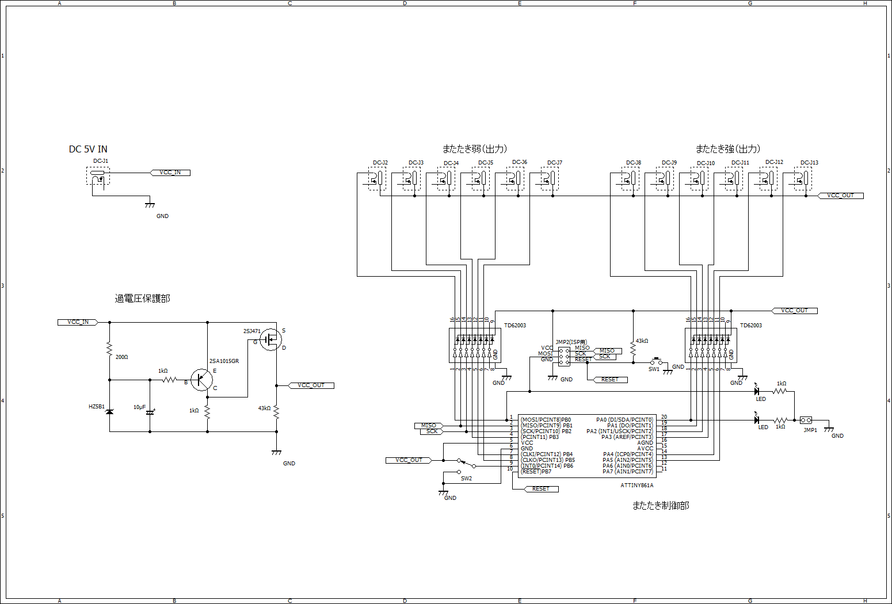
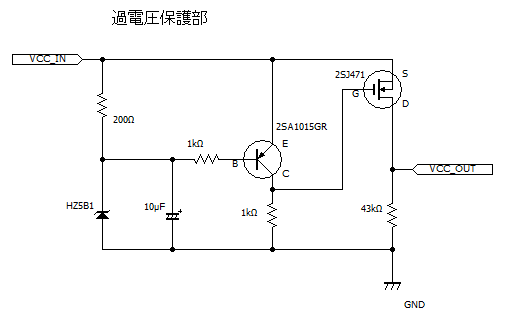

# またたき回路
- 書いた人: Kenichi Ito(nichiden_27)
- 更新日時: 2017/03/25
- 実行に必要な知識・技能: 電子回路、AVRマイコン
- タスクの重さ: 3/数週間
- タスクの必須度: 2/たまにやるべき
- 元資料
  + `一等星投影機付属またたき回路仕様書.docx` by 西村陽樹(nichiden_23)

## 概要
いっとうはただ明るいだけでなく、またたいているように見える効果が付いています。
そのための「またたき回路」の開発は日電に委託されており、遅くとも20主投の頃から存在していました。
現行の回路は23が作ったもので、プログラムは27で改造したものです。

## 原理
またたきの再現には様々な方法が考えられるが、ここでは20代から現在まで使われている「**1/fゆらぎ**」と「**間欠カオス法**」による方法を解説する。

### 自然のゆらぎ
またたきのパターンは周期的ではなく、ランダムであるべきだということは直感的にわかるだろう。
ただし、日電が用いたのは完全な乱数ではなく、自然の「ゆらぎ」を擬似的に再現したものである。

恒星のまたたきは、大気の「ゆらぎ」による光の強弱の変化と説明できる。
ゆらぎ(fluctuation)とは、ある量が平均値からずれる現象である。
なかでも、**1/fゆらぎ** は自然現象によくみられ、星のまたたきもこれに分類される。

電子回路などにおけるゆらぎはノイズとして表れる。
ノイズは周波数特性(パワースペクトルと周波数の関係)によって分類されているが、1/fゆらぎによるノイズは**ピンクノイズ** と呼ばれる。
ピンクノイズはパワーと周波数が反比例しており、高周波成分であるほど弱い。
これを可視光に当てはめると波長の長い色が残り、ピンク色に見えるというわけだ。

### 間欠カオス法
従って、いっとうの明るさを1/fゆらぎに近いパターンで変化させればまたたきが再現できる。
1/fゆらぎをプログラムで生成する方法はいくつかあるが、またたき回路では処理の軽い「**間欠カオス法**」が用いられてきた。
これは、漸化式によって擬似乱数を作り出す方法である。
以下に基本となる式を示す。

```math
\begin{aligned}
    \begin{cases}
        X(t＋1)=X(t)+2X(t)^{2} & (X(t)<0.5)\\
        X(t＋1)=X(t)-2(1－X(t))^{2} & (X(t)\geqq 0.5 )
    \end{cases}
\end{aligned}
```

ただし、実はこのままではこの式はあまり実用的でない。
まず、`X(t)＝0.5`の場合、以降のXの値は0に張り付いてしまう。
また、0と1の近傍では値の変化が小さくなりすぎる問題もある。

そこで、実際のプログラムでは上限と下限の付近で若干値をいじるようになっている。
また10進数の浮動小数点演算はマイコンでは時間がかかりすぎるので、実際には`double`型ではなく`unsigned long`型(32bit長整数)の値としてある。

## 回路
北天用と南天用の二つが現存する。
回路は全く同じで、プログラムだけが違う。

電源電圧はマイコン、投影機共に5V。
回路には**過電圧保護回路**があり、約5.2Vを超える電圧を印加すると電流を遮断する。
これは、いっとう以外の投影機の電源電圧が12Vであり、刺し間違いによる故障を避けるためである。
耐圧は15V程度の設計であるため、24Vなどの高電圧をかけると保護回路が破損する危険がある。



回路図を掲載する。
**電源部**(過電圧保護部)、**またたき制御部**(マイコン)、**またたき出力部**(トランジスタアレイ、DCジャック)が主だった構成である。


### スイッチ類


トグルスイッチ(`SW2`)が、またたきのON/OFFスイッチである。
OFFにすると消灯するわけではなく、またたきの効果のない常時点灯となる。
いっとうユニット自体のテストやデバッグに使用することを想定している。

スイッチの近くに設置されたLEDはまたたきの確認用である。
横のジャンパピンを外すと消灯するので、上映中は外しておくとよい。

タクトスイッチはリセットスイッチで、不具合発生時に押すとマイコンが再起動する。

### またたき制御部
`ATTiny861A`を使用している。
`SW2`がpin9(`INT0/PB6`)に繋がれており、INT0割り込みを使用してまたたきON/OFFを切り替える。

INT割り込みはI/Oポートが出力設定になっていても機能するので、プログラムでは`PB6`が出力設定になっていても問題ない。
また、ON/OFFの制御をするだけのスイッチであるためチャタリング除去はなされていない。

`PB0`、`PA0`に確認用LEDが接続されている。

### またたき出力部
`TD62003`トランジスタアレイを使用する。
`ATTiny861A`の`PA0-PA5`/`PB0-PB5`の12本が出力ピンとなる。
いっとうとの接続部はφ2.5の基板用DCジャックを使っている。
各出力ピンが`HIGH`になると、対応したDCジャックのGNDが導通して電流が流れる仕組みである。

### 過電圧保護回路
23の製作時に、こうとうユニットの電源電圧が12Vであったことから急遽設置された。
電源を12Vに統一して3端子レギュレータで5Vにするアイデアもあり、作り変えの際には考慮されたい。



閾値の検出に使用しているのはツェナーダイオードである。
ダイオードには、逆方向に電圧をかけるとある閾値以上の電位差で逆向きに電流が流れ、それ以上電位差が大きくならない効果がある。
その閾値をツェナー電圧という。

通常のダイオードでは非常に高いツェナー電圧だが、ツェナーダイオードは不純物を混ぜることでツェナー電圧を下げている。
またたき回路で使用した`HZ5B1`のツェナー電圧は4.6-4.8V。
カソード側の200Ωの抵抗により、回路全体としての閾値を**5.1-5.2V**としてある。

`VCC_IN`が約5.1V以下の場合、ツェナーダイオードには電流が流れず、`2SA1015GR`はOFFの状態になる。
`2SA1015GR`のコレクタはプルダウンされているので0Vに落ち、FET(`2SJ471`)にはゲート・ソース間電圧が発生する。
従って、FETのソース・ドレイン間に電流が流れ、`VCC_OUT`に入力電圧がそのまま出てくる。

`VCC_IN`が約5.2Ｖを超えると、ツェナーダイオードに逆向きの電流が流れ始める。
`2SA1015GR`にエミッタ・ベース電流が流れることで、コレクタに電流が流れて`2SJ471`のゲート電圧が`VCC_IN`とほぼ等しくなる。
結果、ゲート・ソース間電圧はほぼ0Vとなり、FETがOFFの状態になって電源が遮断される。

この回路の耐圧はツェナーダイオードの許容損失による。
入力が約15Vを越えると許容損失を超え、ダイオードが焼き切れる可能性がある。
仮に焼ききれた場合、ツェナーダイオードに電流が流れない状態と同じになり、入力電圧が`VCC_OUT`に出力されてしまう。
大変危険なので、高電圧の電源を接続しないよう注意すべきだ。

保護回路の閾値は、ツェナーダイオードのツェナー電圧やカソード側の抵抗値を調整することで変更できる。

## プログラム
書き込みの際、Fuseビットの`DIVCLK8`を`Disable`する必要がある(内部クロックを1MHzではなく8MHzで使用するため)。

27でプログラムを改修した際、Arduino IDEを使用してビルドと書き込みを行った。
Arduinoの中身はAVRマイコンなので、マイコン(ボード)の定義さえ読み込めばAVRマイコンに書き込むことも可能である。

ボードマネージャでhttp://drazzy.com/package_drazzy.com_index.json を指定すればよい。
手順の詳細は[Arduino IDE に ATtiny45/85/2313 他の開発環境を組み込む](http://make.kosakalab.com/make/electronic-work/arduino-ide/attiny-dev/)など参照。

### セットアップ、メインルーチン用
int main(void)
setupを呼び出して初期設定を行ったあと、、割り込みを許可してあとは無限ループに入る。
void setup(void)
I/Oポートの設定、タイマ0(CTCモード)とプリスケーラの設定、タイマ0割り込みの設定、INT0割り込みの設定を行ったあと、PORTAとPORTBをすべてLにする。

### INT0割り込み
ISR (INT0_vect)
PORTAとPORTBをすべてHにする。

### タイマ0割り込み
ISR (TIMER0_COMPA_vect)
まず、PORTAとPORTBをすべてHにする。つづいて、あらかじめ設定したtwinkle_rate(タイマ割り込み何回につき一回乱数値を更新するか)にもとづいて乱数更新時期の判定を行う。乱数を更新する場合は、まずあらかじめ設定したtwinkle_shift(乱数値更新何回につき一回出力をビットシフトするか)にもとづいてビットシフトが必要かどうか判定する。ビットシフトが必要ならばport_shift()を呼び出して出力をビットシフトする。その後chaos_renew()を呼び出して乱数値を更新し、12個の新たな乱数値をそれぞれのled_intに格納する。
乱数の更新が必要ない場合には、上述の動作の代わりに1.1msecのdelayをはさんで時間を調節する。どちらの場合でも、その後は7usecのdelayループをled_int回実行し、その後出力ピンをＬにする。すべてのピンがＬになったら割り込みを終了する。

### 乱数値更新
unsigned long chaos_gen(unsigned long y)
入力されたyの値(最大32768の整数)にたいして、間欠カオス法によって生成された新たなyの値を出力する。
void chaos_renew(void)
ISR (TIMER0_COMPA_vect)内において乱数値を更新する関数。まずPORTA(またたき強)用の乱数値chaos[0]からchaos[5]までを更新する。その後、その値をあらかじめ設定したchaos_divで割り、これもあらかじめ設定したmin_strongを加えて、結果をled_int[0]からled_int[5]に格納する。(このようにした理由は、chaos[i]の値は32768までの整数値であるが、このままではタイマ0割り込み時のdelayループに使うには値が大きすぎるため、適当な2の乗数chaos_divでまず除算する。。そしてその値にさらにmin_strongを加える。min_strongはまたたき強用のled_intの最小値であり、タイマ0割り込みにおいて最低でもmin_strong回以上はdelayループが起こるようになっている。)その後、次にPORTB(またたき弱)用の乱数値chaos[6]からchaos[11]までを同様に更新する。0~5と異なるのはmin_strongではなくそれより小さなmin_weakを加えている点である。min_weakはmin_strongよりも大きな整数の値で、これが大きいほどled_intの最小値が大きくなる。led_intの最大値はあらかじめ設定したled_int_maxによって決まっているため、min_weakまたはmin_strongが大きいほどled_intの値域の幅が狭まり、結果としてまたたきが目立ちにくくなる。

### 出力ビットシフト
unsigned int left_shift(unsigned int i, unsigned int a)
0から５までの６個の数字が並んでいる数列を左回転でaビットシフトした際、もともとiがあった位置にくる数をあたえる。たとえば、0から5までの数字が
0	1	2	3	4	5
とならんでいた場合、左に3ビットシフトすると
3	4	5	0	1	2
となる。この場合もともと3があった位置にくる数字は0なので、left_shift(3,3)の値は0となる。
void port_shift(void)
タイマ0割り込み中に呼び出される。PA0~PA5、PB0~PB5にはled_int[0]~led_int[11]が対応するが、その対応の仕方を変更する関数。たとえば、ある段階で
led_int 	0  1  2  3  4  5  		6  7  8  9  10  11
portA	0  1  2  3  4  5 	portB	0  1  2  3   4   5
という対応になっていたとする。port_shift()が呼び出されると、portAとportBのビットの対応を左回りに1ビットまたは4ビットシフトする。その区別は制御用の乱数shift_chaosの判定で行う。たとえば、左回りに1ビットシフトした場合、対応は
led_int	0  1  2  3  4  5		6  7  8  9  10  11
portA	1  2  3  4  5  0		1  2  3  4   5  0
となる。逆に4ビットシフトした場合には、
led_int	0  1  2  3  4  5		6  7  8  9  10  11
portA	4  5  0  1  2  3		4  5  0  1   2  3
となる。
この対応の変更を定期的に行うことによって、ゆらぎの周期性を目立ちにくくしている。
