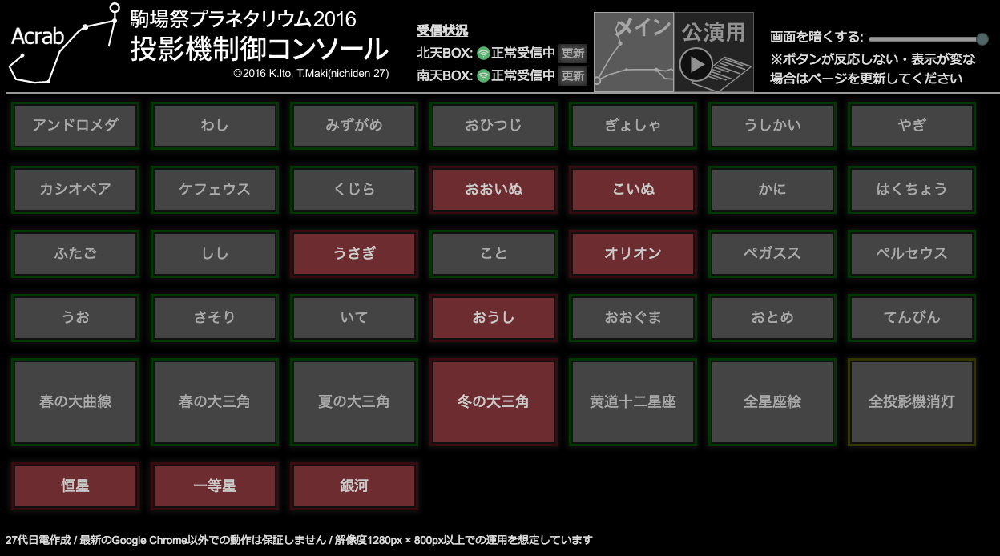
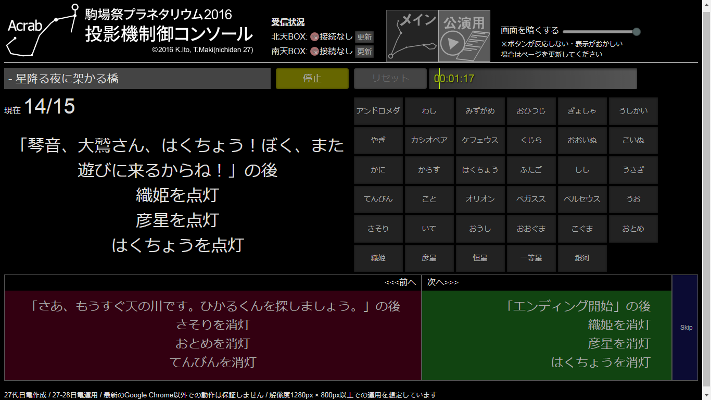

# 無線制御(Acrab)
- 書いた人: Kenichi Ito(nichiden_27)
- 更新日時: 2017/04/13
- 実行に必要な知識・技能: Web制作、JavaScript
- タスクの重さ: 3/数週間
- タスクの必須度: 4/毎年やるべき

## 概要
`Acrab`は、27代で開発した投影機無線操作用Webアプリケーションです。
最新のブラウザ(Chrome推奨)があれば、どんな環境でも使うことができます。

名称は、ブラウザで星座絵などを操れることからApplication for Constellation Remote controlling Assistance on Browserの頭文字をとりました。
さそり座β星の固有名でもあります。

## 使い方
### 下準備
まず、[Acrabの各種ファイル](https://github.com/macv35/nichiden27/tree/master/ACRAB)を同じフォルダに配置する。
ファイルの読み込みにAjaxを使っているので、index.htmlをそのまま開いただけ(file:///)では機能が使えない。
回避方法は「Ajax ローカル」などとググれば複数出てくるが、ローカルにWebサーバを立てる方法を解説する。

Windowsでローカルホストを立てるには、[XAMPP](https://www.apachefriends.org/jp/index.html)を使うのが簡単だ。
GUIなので、操作も分かりやすいだろう。
MacならApacheが標準で入っているはずなので、`sudo apachectl start`を打てば`httpd`が動き出す。
設定については、ググれば役に立つ情報が得られる。

### 起動と接続
localhostにアクセスすれば以下のような画面が表示されるはずだ。
もしボタンに日本語が表示されない場合、設定ファイルの読み込みに失敗しているので再読み込みすること。



次に、`Piscium`との接続を確認する。
`Piscium`の電源が入っていて、Wi-Fiネットワークに接続していれば、画面上の「受信状況」が緑色に変わるはずだ。

もし「接続なし」のままなら、PCと`Piscium`が同じLANに接続しているか(PCが別のルーターに接続してしまうミスは結構ある)、受信モジュールのIPアドレスが正しいかなどを確認しよう。
「受信状況」欄右の更新ボタンを押すと、`Piscium`へのリクエストが再送される。

無事接続できたら下に並ぶボタンを押して投影機をオンオフさせてみよう。
投影機を繋いでいなくても、コマンド自体は送ることができる。
`Piscium`から応答が来なかった場合はボタンの色が変わらないので、不具合に気づける。

### 公演用画面
ソフトの指示を次へ・前へのボタンで実行できるモード。
画面上に「**公演用**」ボタンがあり、押すと画面が切り替わる。



左上のメニューから番組名を選べるので、選んでから「**開始**」ボタンを押すと一番初めのコマンドが送信される。
下にタイミングが表示されるので、緑色の「**次へ**」ボタンを押して番組を進行する。
「**前へ**」ボタンでは、直前と逆の指示を送信できる。

「開始」した後は左のボタンが「**停止**」「**再開**」に変化するが、これは右上のタイマーが止まるだけで深い意味はない。
「**リセット**」ボタンを押すと、タイマーと番組の進行状況が最初に戻る。

誤操作防止のため、「リセット」は「停止」状態でないとできない。
また、番組選択メニューは「リセット」しなければ操作できない。

## プログラム
`Acrab`はWebの技術を使って通信や画面表示を行っている。
画面の情報はHTML、デザインはCSS、内部処理や画面の書き換えはJavaScript(以下JS)という構成だ。

### ファイル構成
以下のようなディレクトリ構成になっている。
ファイルを動かす際はリンク切れに注意すること。
```
ACRAB
├── acrab_conf.json
├── img
│   ├── acrab-banner.svg
│   ├── main_01.png
│   ├── main_02.png
│   └── (省略)
├── index.html
├── js
│   ├── acrab_main.js
│   ├── acrab_scenario.js
│   └── jquery-3.1.0.js
├── scenario
│   ├── 0.json
│   ├── 1.json
│   ├── (省略)
│   └── csv
│       └── (省略)
├── style.css
└── testscript.json
```
`index.html`がAcrabのメインページである。
デザイン関連の記述は`style.css`に分離した。
`acrab_conf.json`には、各種設定が格納されている。

`img/`以下にはページで使用した画像、`js/`以下にはJavaScriptのコードが入っている。
`scenario/`内は、番組の指示書を指定形式で入力したデータ。

### 技術要素
#### HTMLとCSS
最近のWebアプリは、サーバ側でHTMLファイルを動的に生成して送ってくることが多い。
しかし、`Acrab`は**静的なHTMLファイルを準備し、クライアント(ブラウザ)側で書き換える** 方式を採っている。
単に開発が楽であること、サーバ側で作業する必要がないこと、多数のユーザに後悔するような規模でないことがその理由である。

`Acrab`の**ページ構成** を変えたければ`index.html`を、**色やサイズ** なら`style.css`を編集すれば良い。
どちらもググれば分かる程度の機能しか使っていないつもりなので、Webの経験がなくても対応できるだろう。
それぞれの内容についてはここでは触れないが、JS部分と連動する箇所は都度解説する。

#### jQuery
プログラムにはJSを用いていると書いたが、素のJSだけで書くと記述が長くなってしまう。
そこで、jQueryというライブラリを採用している。
動的なページの書き換えやAjaxによるファイル取得などを簡単に書けるようになり、コードを読みやすくできる。

近頃のWebアプリはサーバ側が急速に発展し、jQueryは不要な存在となりつつあるが、`Acrab`はクライアントサイドだけで動作する仕様のためあえて採用した。
数年前の流行りとはいえネット上に解説記事が充実しており、学習が容易であることも採用の理由だ。

jQueryは単一のjsファイルにまとめて配布されるので、最新版をダウンロードして`js/`内に入れておけば使えるようになる。
わざわざダウンロードしておくのは、ネットに接続できない本番ドーム内などでもjQueryを取得できるようにするため。

jQueryの機能は解説しないのでググって補完されたい。
`acrab_main.js`や`acrab_scenario.js`内に頻繁に登場する`$`という文字は、jQueryを呼び出すためのものである。
`$.(メソッド名)`といった形式で各種メソッドを使用できる。

#### JSON
`Acrab`では、各種設定を個別ファイルに分離している。
投影する星座の名称を変えたい、指示書を編集したいと言った要求はいつ来てもおかしくない。
こうした変更に迅速に対応できるよう**JSON**形式の設定ファイルを読み込む方式とした。

JSON(JavaScript Object Notation)は、JavaScriptのオブジェクトの形式でデータを記述するものである。
「JavaScriptのオブジェクト」というのは配列や連想配列を入れ子にした構造を指す。
```js
{
  "hoge": [ 1, null ],
  "fuga": {
    "one": [ true, "tenmon" ],
    "two": "nichiden"
  }
}
```
上の例のように、項目にラベルを付ける、入れ子にするといったことが比較的シンプルな記述で可能になる。
また、オブジェクトなので`.`でラベル名を繋ぐだけでデータを取り出せる(例: `fuga.one[1]`は`"tenmon"`)。
文法がJavaScriptからの流用なので親和性がよく、読み込みが簡単なのも嬉しい。

ただ、文法がたいへん厳しくかつ目で眺めてもミスに気づきにくいので、パースエラーが出ないことを確かめてから使うよう心がけたい。
[JSONLint](http://jsonlint.com/)など、JSONの文法ミスを検出してくれるサービスが存在する。

### 指示書の検討
PCで投影機を操作する場合、指示書の内容が表示されていると便利なのは言うまでもない。
しかし、コードに直接書き込むような方式では、翌年にはもう使えなくなってしまう。
そこで、`Acrab`が**外部の指示書ファイルを読み込む**方式を検討した。

#### 指示書をどう表現するか
ソフトの指示書には様々な情報が書かれているが、主投影機に限れば必要な情報は

- 順番
- セリフ
- タイミング
- 指示
    + どの投影機を
    + 点灯する/消灯する

となる。
一公演に対して普通は多数のセリフが存在し、また一つのセリフに複数の投影機への指示がつくこともある。
つまり、「番組」→「セリフ(タイミング)」→「指示」と**階層的に表現**できればとても嬉しい。

ソフトは指示書をExcel(xlsxファイル)で作成している。
xlsxファイルはかなり複雑で、プログラムから読むのは大変なので、テキスト形式のデータに変換したい。

エクセルならCSVが扱えるが、CSVは表形式のデータとなり階層構造が表現できない。
階層状にできるXMLかJSONのうち、XMLは扱いづらそうだったため**JSON**を採用した。
JSONならばJavaScriptの`Acrab`との親和性もある。

具体的にどのような構造のJSONかについては、ソースコード解説の記事にゆずる(概ね上の箇条書きの通りと思ってよい)。

#### エクセルからJSONデータへ
指示書のデータはソフトが持っているので貰ってくるとして、一発でJSONに変換できる訳ではない。
日本語の指示を**プログラム用の形式にする**作業が待っている。

とはいえ、JSONを手で書くのは非常に面倒で、しかもミスがあるとパースができない。
そこで一旦CSVにして保存し、CSV→JSONの変換はプログラムに任せることにした。

CSVは階層データを表現できないが、1フィールド(Excelで言う1セル)に**複数データを無理やり入れてしまえば**なんちゃって階層データが作れる。
今回は二階層しかないので、下の階層は**JSONを直接入力してしまう**と言う苦肉の策を講じた。
変換の手順を表で表すとこのようになる。

| 工程 	| 内容                                	| データ形式     	|
|------	|-------------------------------------	|----------------	|
| 0    	| ソフトからExcelデータを入手         	| xlsx           	|
| 1    	| 人力でJSONへの変換を準備            	| CSV(Shift-JIS) 	|
| 2    	| (Excelで保存した場合)文字コード変換 	| CSV(UTF-8)     	|
| 3    	| プログラムでJSONデータに変換        	| JSON           	|

**工程1** で、JSONに自動変換できる状態にまで指示書を編集する。
この段階は、エクセルで作業した方が余計な列の削除・列移動等が楽だろう。

実装解説でも触れるが、`Acrab`では星座絵や投影機を**半角三文字のコード**で管理している。
投影機の指示もこれに準じたものに変える。
例えば、「アンドロメダ座を点灯する」なら`"And": 1`になる。
詳しくは[実装解説の記事](acrab-code.html)や、本番で使用したデータなどをご覧いただきたい。

この工程で、指示の**曖昧さを完全になくす**ことを目指す。
「いい感じのタイミングでつけてください」のような記述があったり、点灯したまま消灯しない投影機が出たりという事態はよくある。
疑問を感じたら**ソフトあるいはライブ解説者に確認**しよう。
面倒な作業ではあるが、本番直前に気づくよりは対処に余裕を持てる。

**工程2** はExcelからCSVを出力した場合に必要だ。
ExcelはCSVをShift-JISで保存するが、文字化けの元凶となるので**Unicodeに変換しておく**のが望ましい。
コマンドで変換しても、テキストエディタで保存しなおしてもいい。

**工程3** でJSONに自動変換となる訳だが、CSV内にJSONを無理やり混ぜているので変換するだけではいけない。
JSONの括弧(`{`,`}`)が`""`で囲まれたり、`"`がバックスラッシュで文字列にエスケープされたりしているので、置換などで修正する必要がある。
27代では`scenario/csv/`に入っている`jsonify.py`というPythonスクリプトで変換と置換の処理をした。

### ソースコード解説
たいへん長くなるので、[Acrabの実装解説](acrab-code.html)に分離する。

## 今後の展望
### 既知の問題
#### 読み込んだ際、設定ファイル(acrab_conf.json)が読み込まれないことがある
開発時に**即時関数**と**jQuery.readyイベント関数**の違いを理解していなかったことが原因。
即時関数を使うのをやめれば修正可能。

(執筆中)
