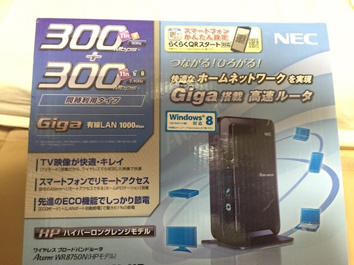
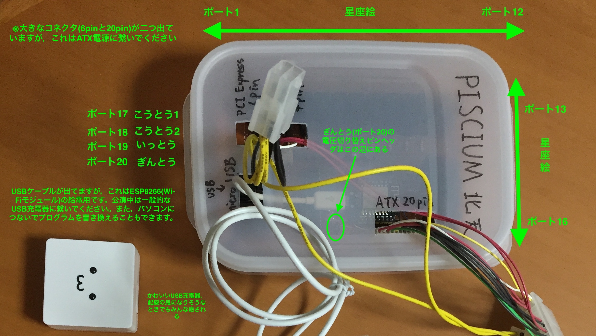
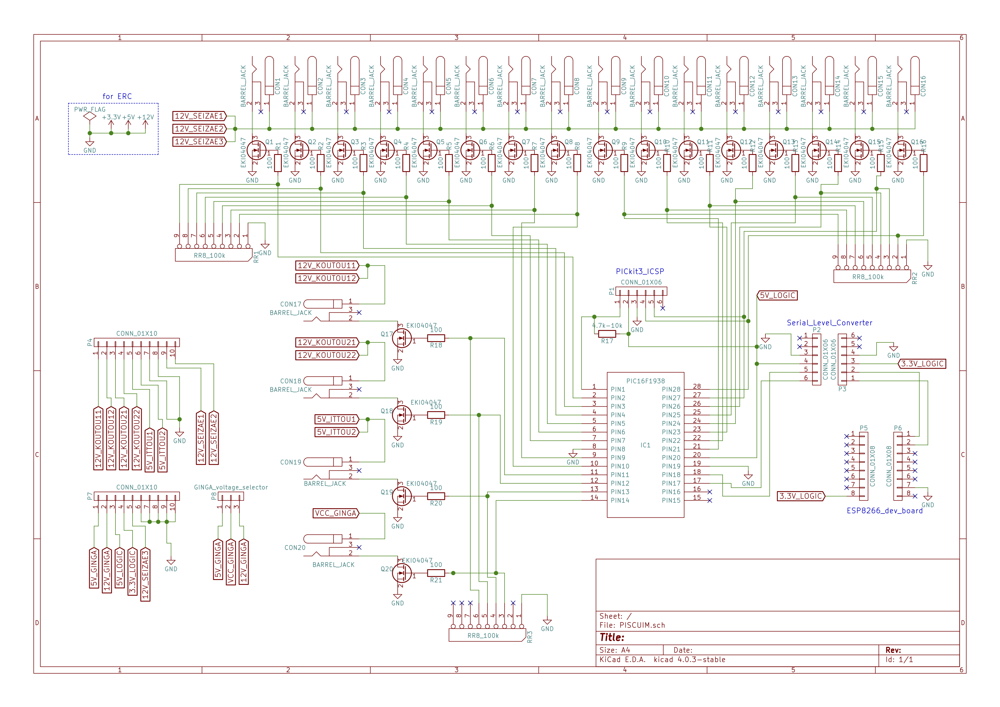

# 無線電源制御装置PISCIUMハードウェア解説

- 書いた人：眞木俊弥
- 更新日時：2017/3/10
- 実行に必要な知識・技能：電子工作の経験，電子回路について一通りの知識，マイコン（Arduino, PIC)，インターネットの仕組み
- タスクの重さ: 4: 一月はかかる
- タスクの必須度：5: しないとプラネ終了/とりあえず前の年のものを使えるようにしておくこと，壊れてたら…頑張ってくれ…

## 概要

※とりあえず使えるようにするだけだったら，**概要**と**使い方**の部分を理解すれば大丈夫です。ブラックボックスになるように設計しました。ただ，故障した…とかいうことになったら，頑張って**技術仕様**のところを理解するか，いっそのこと全部作り直してください。

プラネタリウムの公演と，外で星をぼんやりみている時の差とは何でしょうか？
それは，ずばり，分かりやすい解説やワクワクするストーリーがあるないかです！
そして，その演出をサポートしてくれるものは何と言っても様々な神話や逸話に彩られた星座でしょう。
ただ，一般の人には満天の星空の中から星座を見つけ出すことは至難の技なので，プラネタリウムでは，「星座絵」を投影します。
そのため，ナレーションに合わせて星座絵を点灯・消灯する必要があります。
ただ，投影機からたくさん線を引き出してしまうと，日周・緯度の変化の際の回転で絡まってしまうため，我々のプラネタリウムでは，無線制御を行っています。

27代では，新たに無線制御装置を作り直しました。
その名も，`PISCIUM`(Planetarium Integrated Stars and Constellation Images Utility Module)です！！
（ちなみに，この名前は27日電長伊東氏の発案です。なお，私は長らく`PISCUIM`だと勘違いしていて，ファイル名とかコメントとかを修正する無駄な手間が生じた記憶があります。）
`PISCIUM`を使うことで，みなさんよくお世話になっているWi-Fiネットワークを介して，パソコン，スマホ，タブレットなどWi-Fiの接続可能な端末から星座絵などのかごしい内部の投影機を無線で制御できます。

## 使い方

`PISCIUM`はそのほかのボックス類と同じように，（百均）タッパーを加工したケースに収められています。
かごしいの側面に固定して使うことを想定しています。
また，事前に部室にあるはずの無線Wi-Fiルーターの電源を入れておきましょう。

使用するには，電源を接続（27代ではパソコン用のATX電源とUSB充電器を使用）し，出力用の側面のDCジャックに星座絵などの投影機を接続してください。
使用している電源は，[玄人志向の400Wの電源](http://www.kuroutoshikou.com/product/power/atx/krpw-l5-400w_80_/)です。

ATX電源は，20ピンATXと，6ピンPCI Express用のコネクタを使用しています。

`PISCIUM`を上から見たときに，DCジャックが見えていない方を下側面としたときに，

- 上側面と右側面が星座絵(12V)。全部で16ポート。ポート1からポート16まで。
- 左側面が，上から，こうとう1(12V)，こうとう2(12V)，いっとう(5V)，ぎんとう(5Vまたは12V，内部のピンヘッダで切り替え可能,現在は12Vに設定してある。ピンヘッダは上と真ん中が接続されているときは12V, 真ん中と下が接続されているときは5Vになる)

となっています。

左側面だけは，こうとうやいっとうなど，特殊な投影機を接続するためにそのほかのDCジャックとは異なる仕様になっているので注意してください。
また，こうとうを星座絵の所などに接続すると，電力が大きすぎてよくないので，注意してください。
あと，いっとうだけは5Vなので，接続場所間違えるといっとうボックスが壊れます。

無線Wi-Fiルーターに自動的に接続されるので，ブラウザで特定のURLにアクセスすることで制御が可能になります。
ブラウザでの制御に関しては，伊東氏が開発したWebアプリケーション`Acrab`があるので，そちらの説明を参照してください。

なるべくブラックボックスになるように設計したので，何とかなるはずです（だと信じたい）。

### 使用上の注意点

- 電源がついた状態での各投影機の抜き差しは故障の原因になるのでやめてください。
- ATX電源には，大事な自作パソコンを守ってくれる安全装置が付いています。そのため，過電流，過電圧を感知すると自動的に電源が落ちます。PISCIUMの電源設計は甘々なので（すみません…），各投影機のオンオフ時の電圧サージに耐えられず，電源が落ちてしまうことがあります。その場合は，ATX電源の電源を手動で入れ直してください。
- かごしいのグラウンドが弱いため，稼働している間に全体が帯電してしまうようです。
27代の公演でも，公演中に火花が飛び散り，空中放電して一瞬ブラックアウトしたことがあります。
**28の皆さんには，かごしいのアース接続を何とかしてほしいです。**
そうでないと最悪の場合，火花放電により出火します。
かごしい本体とは導通していることは確認しているので，かごしい
か，それと導通しているごきぶりをアースしてください。
アースするときは，より線ではなく，単芯の太めの導線を使用し，体育館の柱など地面に突き刺さっている大きい金属に接続してください。
アースしただけで治るのかはよくわかりませんが，アースしてないのはまずいです。
- また，グラウンドが弱く，サージに耐えられないので，こうとうの制御は現時点では不可能（電源が落ちてしまう）です。そのため，こうとうは付けっ放しにしておくのですが，最初に点灯するときに，やはり電源が落ちやすいので，何度かトライすることになります…（誰かなんとかしてー）
- 27代の本番では，こうとうが消えてしまって真っ暗になるリスクを回避するために，こうとうの電源は，PISCIUMを通さず，ATX電源のPCI Express 6ピンコネクタから直接給電するケーブルを作成し，こうとうを常時点灯かつPISCIUMの影響を受けないようにしました。
- いっとうの制御は可能ですが，いっとうボックスの瞬き回路の起動に時間がかかり，点灯までにタイムラグが生じるので，現時点では行える状況にありません。
- また，いっとうボックスの方にノイズが乗り，しばしばいっとうが映らなくなる事案が発生したので，本番は結局5Vの別のACアダプタを用意しました。5Vの電源をATX電源とは別に用意するのは無駄なので，できれば，SATAとかHDDとかのコネクタから5Vを取り出せるようなケーブルを新たに作成してほしいです。
- 以上のように，星座絵以外の制御は事実上できないような状況になってしまっています。

## 技術仕様

27代で作成したファイルは全て[Githubレポジトリ](https://github.com/macv35/nichiden27)においてあります。

### 回路

主な部品としては，Wi-Fiの制御を行う`ESP8266`というSoC(System on Chip: マイコン，通信制御回路などが一つのチップの中に収まっているもの）の開発ボード，`ESP8266`からのシリアル通信を受信して各DCジャックを制御するPICマイコン，DCジャックの電流をスイッチングするFETから構成されています。

一見複雑そうに見えますが，DCジャックがたくさんあるだけです。
ただ，いかに単純な回路の反復とはいえども，これはんだ付けして作るのは地獄でした。
私はKiCadの配線図のピン番間違えてFETのはんだ付けし直すはめになったのですが，やばかったです。
みなさんも配線図書き終わったらじっくり見直すようにしましょう。無駄な仕事が増えます。

### ESP8266の開発ボード周りのソフトウェア

（中華製の安物の）Wi-Fi入りマイコンボードを利用しています。
この`ESP8266`は，`Xtensa`というアーキテクチャを採用していますが，有志により，Arduino IDEで開発できるようになっていて，Wi-Fiサーバーなどの高度なプログラムもライブラリとして整備されていて，我々素人にとっては非常に開発のしやすいモジュールです。
また，今回使用しているボードには，すでに書き込み用の回路も付いているので，USBでパソコンに接続するだけで開発できます。
ただ，USB-シリアル変換素子はArduino純正のものとは違うので，ドライバをインストールする必要があります。
USB-シリアル変換素子の型番は，`CH340g`です。Githubとか製造元のサイトからドライバ落としてきてインスコしてください。
また，ボードの書き込み設定などは，[このサイト](http://trac.switch-science.com/wiki/esp_dev_arduino_ide)などを参照してください。
"ESP8266 書き込み"とかでググるとわんさか出てくるはずです。

27代が開発したプログラムは，`ESP8266`上でwebサーバー（のようなもの）を動かし，特定のURIのGETリクエストを受け取ると，シリアル通信でPICマイコンに点灯状況を送信する形になっています。
IPアドレスは，固定IPで，北天が192.168.11.100，南天が192.168.11.101になっています。

#### 使い方

[Wikiへのリンク](https://github.com/macv35/nichiden27/wiki/Piscium#usage)

Send GET request to certain url.

1. **Refresh Confirm**  
(example) http://(ip)/refresh_confirm/status.json
1. **Set Port**
Set ON/OFF of each port.  
(example) http://(ip)/setPort/status.json?P01=0&P02=1
1. **Set Constellation Name**  
Change names of pin used in communication.  
(example) http://(ip)/setConstellationName/status.json?p01=And&p02=Aql...
1. **All Set**  
Set all port ON.  
(example) http://(ip)/allSet/status.json
1. **All Clear**  
Set all port OFF.  
(example) http://(ip)/allClear/status.json

以上の5種類のコマンドが用意されています。
通常の公演時は，`Acrab`がこの辺のことはやってくれるはずですが，回路関係のデバッグをする際には，手持ちのスマホとかでこれらのURIにアクセスしながらやると楽です。

`ESP8266`が正しくURIをパーズすると，シリアル通信（UART）でPICマイコンにコマンドが送られます。
"NS"の2文字を送ったあとに，各DCジャック（ポート）20個分の点灯状況を点灯の時"1"，消灯の時"0"として，20文字分送ったあとに，23文字目に"\\n"（改行）をパケットとして送るプロトコルを使用しています。
名付けてNS（Nichiden Seizae）プロトコル…雑です，はい，すみません。
まあ，どうせUARTなんだし，こんな雑なプロトコルでも問題は起きていませんのでご安心を。

また，UARTでPICにパケットが送られるのと同時に，GETリクエストに対して，現在のステータスを表したjsonを返します。

参考までに，ソースコードのリンクをつけておきます。
（汚いのであんまり見ないでー。URIパーザーの部分とかは他のクラスに分けるとかするべきだった。）

[Arduinoのスケッチ](https://github.com/macv35/nichiden27/blob/master/PISCIUM/PISCIUMServer/PISCIUMServer.ino)

### PICマイコンのソフトウェア  

`ESP8266`から送られてきたシリアル通信をデコードして各ポートのFETをオンオフするだけの子なので，大したことはしてないです。
`ESP8266`は3.3V駆動なのに対して，PICは5Vで駆動しているので，間にシリアルレベル変換素子は入れてあります。
MPLAB Xのプロジェクトファイルが引き継ぎ資料の`/pic_decoder/`ディレクトリに入っています。
もし万が一，PICが壊れたりした場合は，`PICkit3`を差し込めるピンヘッダを用意しておいたので，PICを交換して書き込み直してください。
書き込み方は，[PICkit3の使い方](http://ww1.microchip.com/downloads/jp/DeviceDoc/52010A_JP.pdf)をみてください。
