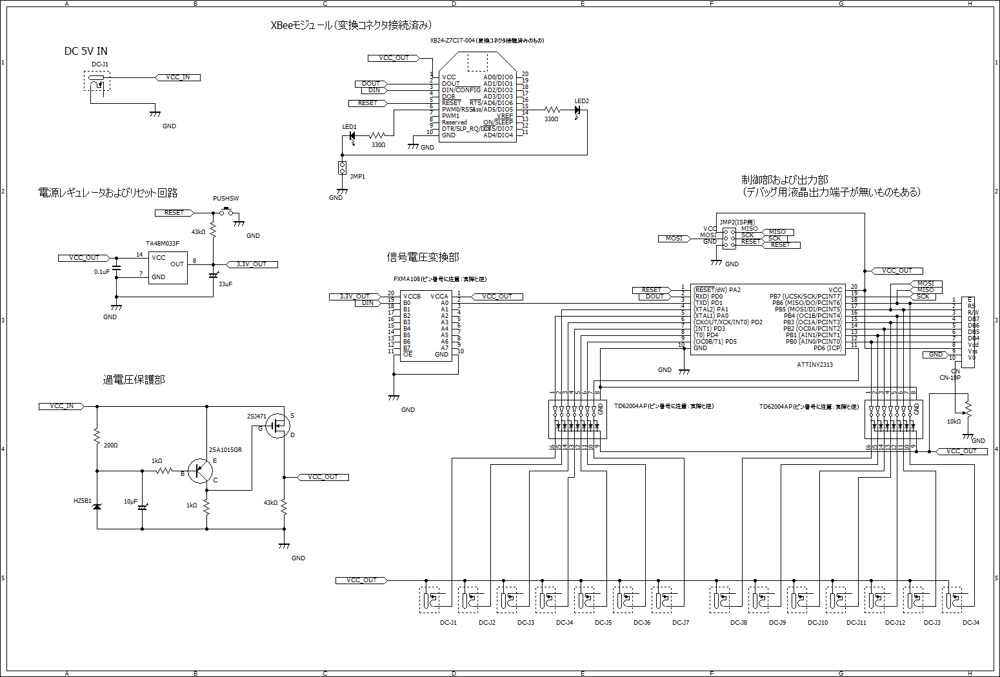
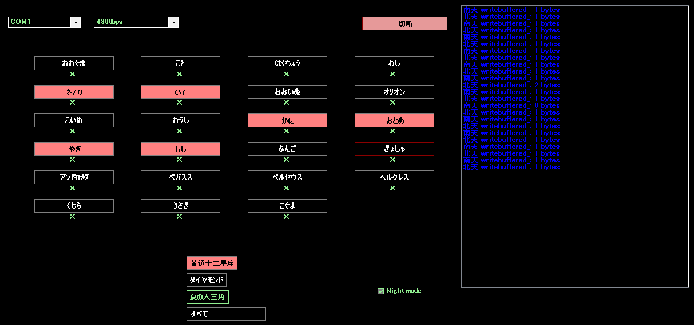
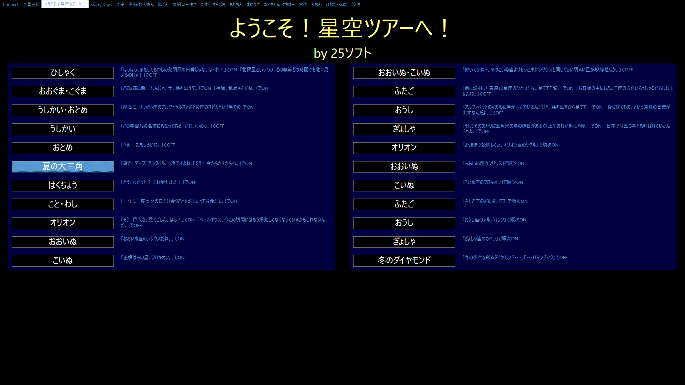

# 無線制御

- 書いた人：Kenichi Ito(nichiden_27)
- 更新日時：2017/3/20
- 実行に必要な知識・技能：電子回路、マイコン
- タスクの重さ: 5/準備だけで数ヶ月
- タスクの必須度：4/毎年やるべき

## 概要
星座絵は、プラネのにとって重要な要素ですが、常に点けたままというわけにはいきません。
解説やソフトの流れに合わせてたくさんの星座絵をリアルタイムでオンオフできる必要があるのです。

ただ、星座絵投影機の本体は、他の主投影機同様日周緯度変装置により回転します。
そのため有線での制御は困難です。
そこで、日電では星座絵の制御に無線を採用してきました。

## 沿革
### 16-21主投
データとして共有されている限りの資料では、16日電が**FM変調方式** の電波を採用していた。
FMとは周波数変調方式のことで、ある周波数を閾値として0か1かのデジタル信号を表すというわけだ。
ただし、高周波のノイズが紛れ込むと0が1に反転してしまう問題があり、誤り訂正の工夫をしていたようだ。

この頃の情報は不完全で、不明なことも多い。
19日電の資料には、北天側で信号を受信し、南天側のサブ機に有線で信号を送ったとの記述がある。
送信機・受信機にはPICマイコンを使っていたようだ。

### 22主投
22では、AM変調の無線モジュールとAVRマイコンを採用した。
英RF Solutions社の`AM-RT`/`AM-HRR`というモジュールを使用していたようだ。

22星座絵は16個あり、16bit(2byte)のデータでオンオフを表現できる。
送信側はトグルスイッチ16個を並べた基板と接続しており、スイッチの状態を読み取って電波信号に換える。

南北の受信機の区別にも工夫があった。
ジャンパピンの位置で、上位・下位それぞれ8bitのどちらを読み取るか切り替えられる。
これにより、送信側からは南北まとめて信号を送り、受信側で南北を区別する仕組みだ。

しかし、通信のエラーは排除しきれず、タイムラグも大きいものだった。

### 23主投
23日電になり、`XBee`**が初めて採用された。**
`Xbee`は、`ZigBee`というプロトコルを使用した無線モジュールだ。
買ってきて設定するだけで、手軽に無線通信を使用できる。
ロボットやCanSat(模擬人工衛星)の大会でも多数のチームが採用しており、性能は折り紙つきである。

`XBee`にはシリアル通信のように扱えるATモードと、`XBee`自体を制御に使うAPIモードがある。
23で使ったのは前者で、送信側1台をPCに、受信側2台を南北それぞれの受信機回路に接続していた。

23では、これまでのように一方的にコマンドを送るだけでなく、**受信側の状態をフィードバック** することでエラー検出・修正を試みた。
しかし、回路の不備で正しい応答が返らず、星座絵の操作はできたもののフィードバックは実現しなかった。

受信機の回路には22同様AVRマイコンが使われていた。
さらに、過電圧保護回路やトランジスタアレイでのポート制御など、以降の星座絵受信機の基本となる設計がこの時期に生み出されたと言える。

### 24主投
24日電では23の設計を受け継ぎ、受信機を作り替えた。

また、PC操作用のソフト`Constellation Picture Transmitter`が開発された。
黒基調のUIが採用され、「黄道十二星座」「夏の大三角」といった星座グループの一括オンオフにも対応している。
ただ、受信側からのフィードバックで表示を修正する機能はうまく動作しなかった模様である。

### 25主投
25日電はPC側アプリケーションの改良を進め、`Funabashi`を開発した。
しかし、不具合により本番で動かず、24の`Constellation Picture Transmitter`に切り替えたという。

`Fuinabashi`では24と同じように星座一覧から選ぶモードと、ソフトやライブ解説の指示に沿ってボタンが並ぶモードが用意された。

### 26主投
26でも`Fuinabashi`の開発が続けられ、完成に至った。
一方、リハーサルの頃に予備も含めて受信機の故障が相次ぎ、本番時点で北天用一台しか使えない事態に発展した。

急遽解説で使用する星座を14個まで減らし、公演ごとに配線を繋ぎかえる方針で投影を試みた。
しかし、公演間の準備の手間が増えた上、イレギュラーな南北配線により電源喪失が数回発生してしまった。
このため、星座絵の全点灯は最終日になってようやく達成されたのだった。

### 27主投
26までの受信機が全て故障していたことから、再生産が急務となった。
ソフトの要望により、こうとうの無線によるオンオフにも挑戦した。

最終的に、`XBee`からWi-Fi規格のモジュールに変更し、全主投影機をオンオフする能力を備えた`Piscium`が新たな受信機として登場した。

また、Wi-Fi採用により送信側はPC単体で済むようになり、操作用Webアプリ`Acrab`が作られた。

星座絵一覧から選ぶ方式は変わっていないが、内部処理が大きく変容している。
クリックでボタンのオンオフを切り替えるのではなく、受信機からの応答によって全ボタンの表示を更新する仕組みだ。
これにより、必ず実際の投影機と`Acrab`の表示が同期する。
23から続いていた受信機からのフィードバック機能を初めて実用化したと言えるだろう。

また、「公演用」画面においてソフトの指示をファイルから読み込み、進む/戻るボタンで簡単に操作できるようにした。
本番中の負担が大きく軽減され、星座絵のメンバーにも操作を手伝って頂くことができた。

実装など詳細はPiscium・Acrabの個別記事に掲載する。

## 無線通信の要件
無線通信を実現する技術は、プラネの歴史を見ればわかるように様々である。
しかし、手法によらず達成しておくべき機能がいくつかある。

27の`Piscium`や`Acrab`固有の反省点については個別記事内で触れる。

### どの投影機を制御するか
無線制御装置は、元より星座絵を遠隔で点灯させるために始まった。
しかし27では、その対象を全投影機に広げた。

ソフトの「星空が急に現れる」という演出の都合上、こうとうが確実に消える必要があったための措置である。
ところが本番での検証の結果、こうとうはあおとうで確実に搔き消え、しるとうのみの状態でも2等星が見えるか見えないかという状態だった。
こうとうが回路の不安定要素だったこともあり、オンオフは結局不要との結論に至ったのである。

むしろ、本番以上の時間を占める投影機調整で、主投が常時点灯せず、無線から一々操作が必要なのは日電にも各投影機にも大変なストレスであった。
調整時の負担を考えれば、こうとうとぎんとうを無線で操作できる仕様にはデメリットの方が大きいようだ。

一方で、あおとうの全点灯時にもいっとうだけは見えていた。
ドーム内が「昼間」の状態でも一等星の位置が分かるのは日周の位置合わせに便利だったが、昼間に星が見えるのは本来正しくない。

星空を再現するのであれば、**夕日が沈むのに合わせて一等星を少しずつ点灯させるのがベストだろう。**
一等星を個別に操作※するのは難しいにしても、いっとう全体をオンオフする演出を取り入れる価値はあるだろう。
ソフトや他の投影機と一度話し合っておいてほしい。

※とはいえ、いっとうと電源の間には既に「またたき回路」が挟まっている。またたき機能と無線機能を兼ね備えた新たな回路を作れば一等星を個別に操れるかもしれない。

### 送信側と受信側の同期
エアコンの赤外線リモコンを操作していて、障害物などで信号が届かなかった経験があるだろう。
こうした場合、リモコンの表示は「オン」なのに実際はオフ、といった食い違いが起こる。
ここからエアコンを起動するには、ボタンをさらに数回押してやらねばならない。

このように、操作対象と操作画面の状態がずれてしまうと混乱が生じやすい。
特に、数十の星座を番組進行に合わせてタイミングよく切り替えるプラネの現場ではなるべく避けたい事態だ。

これを解決するには、受信機が信号を受け取るたびに送信側に結果を通知する仕組みが有効である。
送信側の結果更新には受信機から受け取ったデータを使えば、**受信機の状態と画面の表示が必ず同期する。**

この手法にもデメリットはあり、送受信に時間がかかるような環境ではボタンを押してから表示が変化するまでにラグが発生してしまう。
現在使われるような高性能のモジュールではほぼ問題はなさそうだが、遅延が無視できない対策が必要だ。

### 冗長化
無線制御装置が本番で突然故障し、予備もないとしよう。
その瞬間から、星座絵は一つも点灯できず、星座絵メンバーの努力が水の泡となる。
このような恐ろしい事態を避けるために、二重・三重の対策が必要だ。

確実かつ思いつきやすいのが、**予備の受信機** を用意しておくことだ。
23〜25代の星座絵受信機は、ほぼ同じ設計のものが最終的に4台作られた。
これで、急に故障しても丸ごと交換してしまえば復旧できそうだ(故障原因を特定して潰せていればだが)。

全く同じものを作るのが難しくても、**壊れやすい部品の予備** を手に届くところに用意しておくだけでもいい。
無線モジュールやマイコンが破損し、買いに行こうにも部品屋はもう閉まっている...といった最悪の事態を回避できる。
また、予備部品は不具合があった際の問題の切り分けにも役立つ。

別の方針として、**手動スイッチの追加** というのがある。
無線通信が絶たれても、受信機のところまで行って手で操作すれば投影機が点灯するというものだ。
回路が余計に複雑になるので27では見送ったが、検討の余地はありそうだ。

### 電流管理
投影機の光源は旧来の電球からLEDにシフトしつつある。
なかでも、強力な光源を必要とする主投影機が昨今相次いで採用しているのが、「パワーLED」だ。
パワーLEDは、一個で1Wや3Wといった大電力を消費する。
それを複数まとめて点灯させると、突入電流はかなりのものになることだろう。

過去の星座絵受信機の故障の原因の多くは、**想定を超えた過電流による端子の故障** と考えられる。
27の`Piscium`で、あえてトランジスタアレイを使わずFETを採用したのも、万一問題が起きても故障が高価な部品にまで及ばないようにするためだ。

すぐに目に見える故障が起きないとしても、大電流が流れる回路であることを意識して、アースの確保や導線の太さの選定などに気をつけてほしい。

### 法令遵守
今や、電波は我々の文明にとって欠かせない資源である。
わが国では、その利用について「電波法」で定めている。

無線局は誰でも勝手に設置して良いものではなく、原則として免許を受けねばならない。
ただし、無線LAN機器などはその例外にあたり、「**技適マーク**」が付いていれば国内で使用してよい。

国内の部品屋などで買える無線モジュールには大概技適マークが付いているので、気にせずに使っても構わない。
しかし、技適マークは日本国内でしか通用しないので、海外の端末やモジュールにはないことも多い。
海外通販で部品を買う場合は、日本の技適を通っているかよく確認するのが望ましい。
